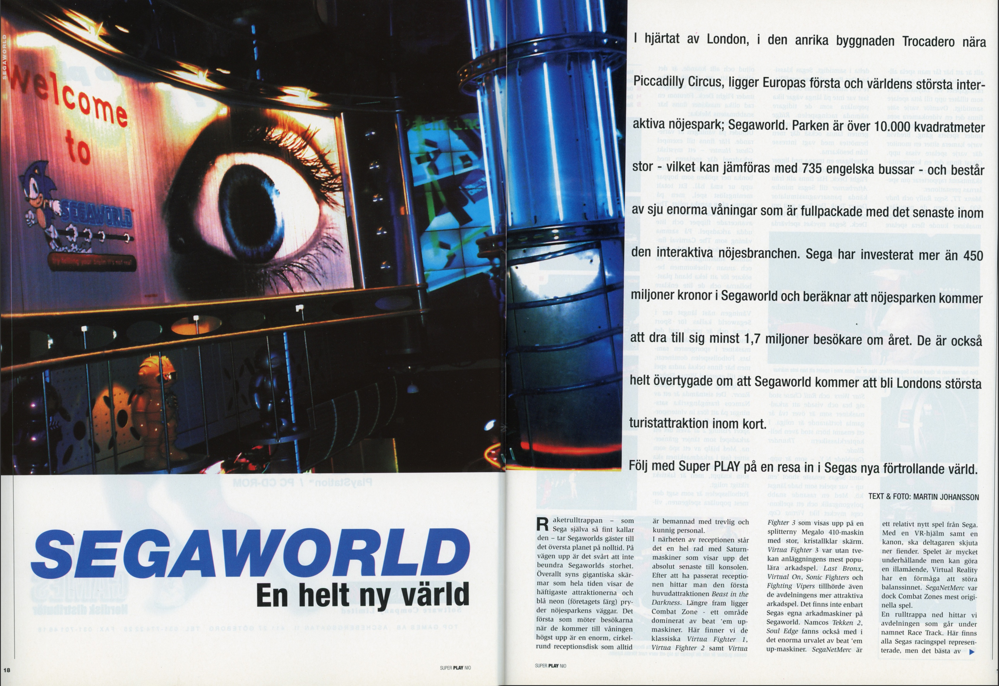
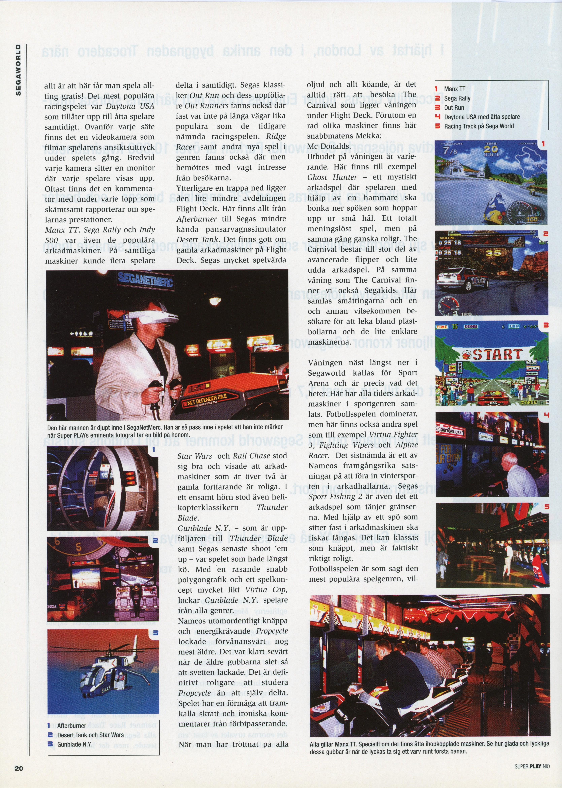

> **The main attractions**
> According to Sega, it will take over four hours to play through Segaworld.  On six of the seven floors in Segaworld, there is at least one main attraction that will take up most of the visitor's time.  Two of the seven attractions in Segaworld are the only ones of their kind.  Sega's ambition is to showcase a new machine at Segaworld each year. The attractions come from Sega's research laboratories in Japan and together with a couple of other projects will have cost over seven billion *(SEK)* in research and manufacturing. 
> 
> **Beast in the Darkness**
> At the top of Segaworld lies the first attraction, named Beast in the Darkness. The attraction itself can be likened to a modern haunted house. In dark, crowded corridors, the visitors walk at a slow pace with nerves on end, only to be surprised to discover that what is to scare them are large screens showing computer-animated monsters.  There are also a couple of extras - dressed as the monster from the well-known movie The Predator - who make an effort to frighten those approaching the exit.  Beast in the Darkness is a sad affair for older visitors, but it is possible to entertain the younger ones who are usually more easily frightened.  
> 
> **Ghost Hunt**
> Ghost Hunt consists of ten cars that go on a set track. Each car can accommodate two people and is equipped with a large concave glass pane, two cannons and four speakers that are installed at head height in the seat. The journey in Ghost Hunt gives way through a dark artificial cave where holograms, various sound and light effects try to create a terrifying atmosphere. After moving a bit into the cave a game is projected onto the glass pane in front of the drivers. It is then the goal to use the cannons and shoot the enemies that appear on the pane and in the end of the journey the drivers' scores are presented.
> Unfortunately, Ghost Hunt is not very fun. The journey through the artificial cave is short and dreary and the only thing that gives anyone any joy is when you shoot the boss to the end and see it explode in a rain of fire.  Ghost Hunt is like Beast in the Darkness better suited for the slightly younger visitors.  
> 
> **Space Mission**
> The most amazing attraction is Space Mission. The actual machinery consists of three large capsules that can hold up to twelve people each. Each capsule has its very own program, which does not resemble the other capsule's programs at all. In Space Mission, Sega's new Virtual Reality-like Mega Visior Display, in short called MVD, is introduced. The helmet is specially manufactured by Sega and adapted for attractions of this kind.  Space Mission offers a journey beyond the ordinary. Those who are impressed by the computer animated sequences in Independence Day will have something new to think about when testing Space Mission 
> 
> **Mad Bazooka** 
> You could call Mad Bazooka Laserdome on wheels. The game itself can be described as a mix between playing among the plastic balls on IKEA and driving a bumper car. There are a total of eight cars each holding two drivers. The battle between the cars takes place in a large arena. Each car is equipped with a cannon that can shoot plastic balls at a speed of 80 km/h. Each hit on each car is recorded and presented when the time has expired. It may seem that Mad Bazooka is not particularly innovative, but it is impossible to deny that it is terribly fun. How much fun it gets depends largely on how good one's opponents are. The slightly younger visitors usually have problems with steering the car and do not aim so well. The older ones, who usually have a high desire for revenge, and above all are more used to sitting behind the wheel, offer really tough battles that lead to many a laugh. 
> 
> **Aqua Planet** 
> Aqua Planet is the only thing of its kind in the world. Like the Space Mission, Aqua Planet uses a capsule with comfortable seats for car passengers to put on MVD helmets. The journey in Aqua Planet is so realistic and amazing that many passengers hold their breath during the journey. Aqua Planet is really different. Just like Space Mission, you are surprised by the highly detailed computer animated sequences shown. The journey goes to places that previously existed only in the imagination and realism increases as the vehicle moves bout during the journey through the underwater cities. 
>
> **AS-1 Simulator**
> This simulator was developed by Sega two years ago and is a magnificent construction compatible with a variety of games. There are two AS-1 simulators on Segaworld. Each machine has a capacity for sixteen people.  Inside the simulator there are two buttons at each seat. With these two buttons the passenger can influence the sequence of events in a relatively limited way. Under the capsule where the passengers are seated, there are hydraulic aids that help create a realistic feeling for those who are along for the rise. The AS-1 simulator is quite cramped and it quickly gets hot and stale in the capsule. Despite this, AS-1 offers a very enjoyable journey.
