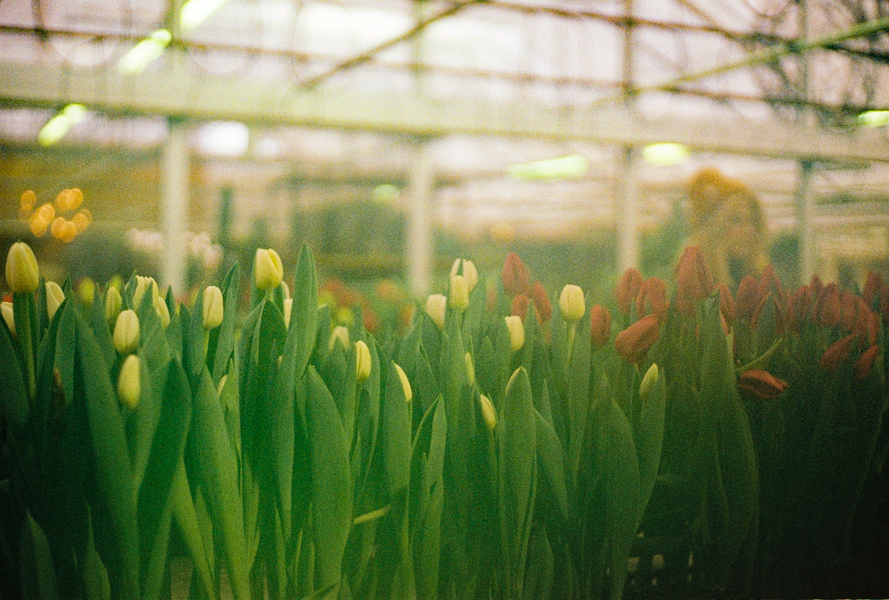
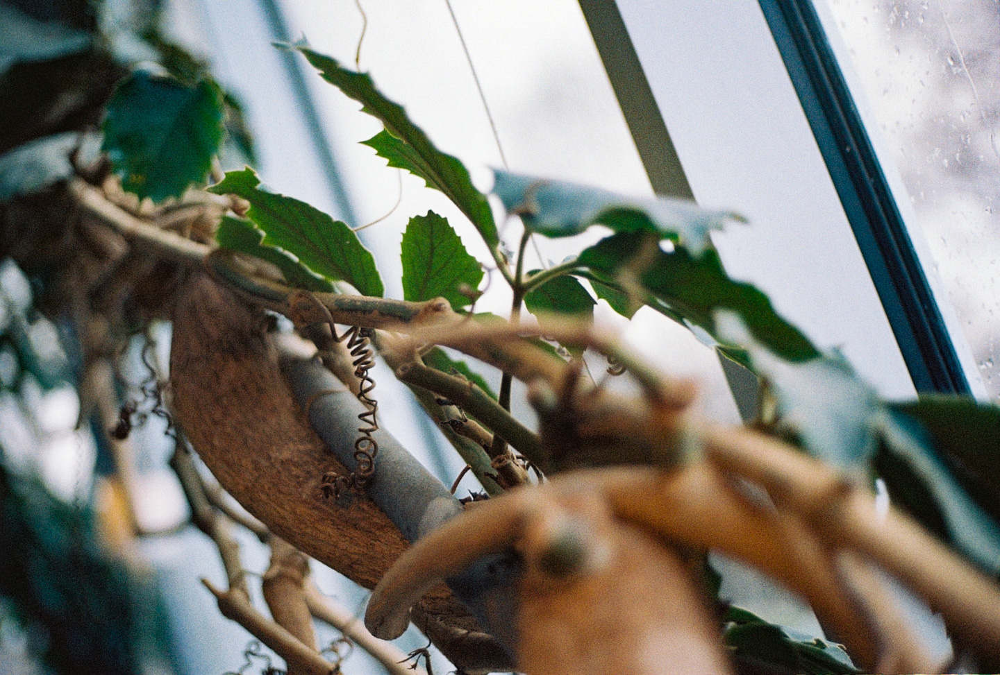
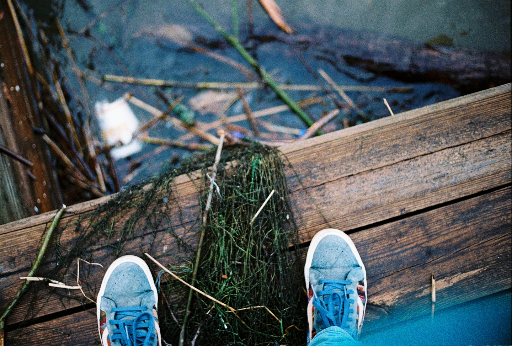
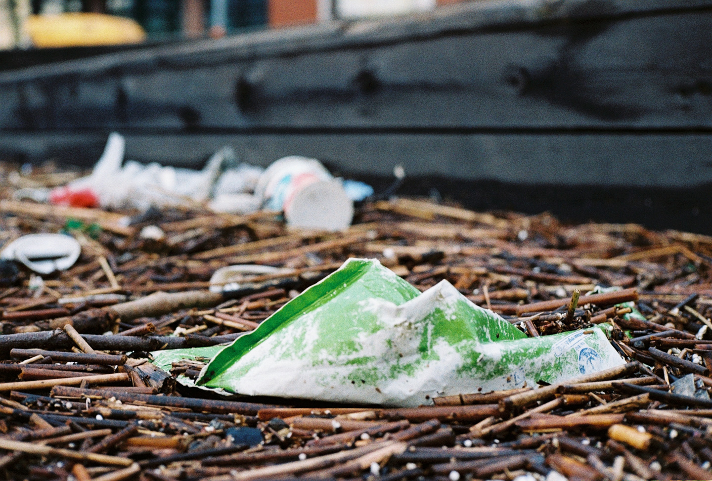
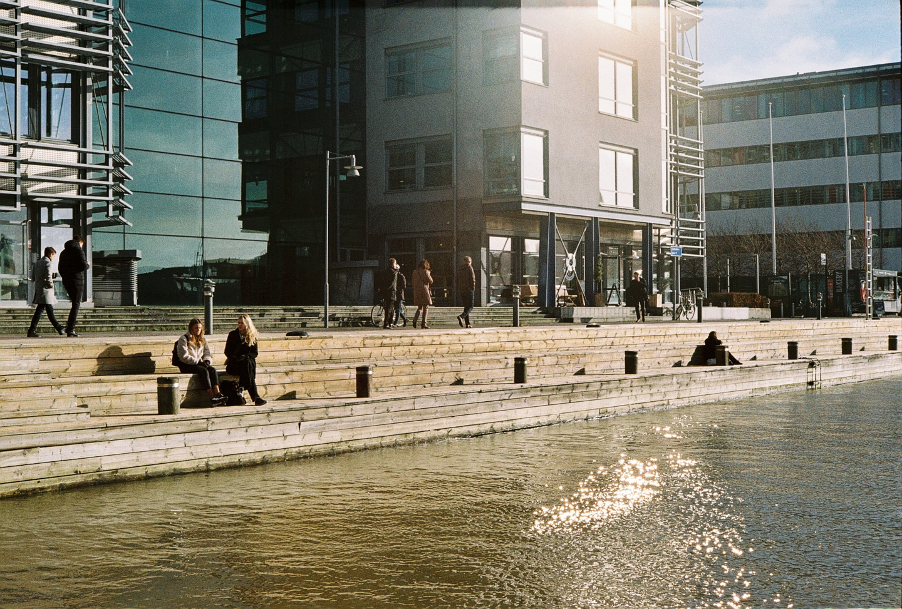

It's been a strange winter, and really a winter in name only. I recently got reunited with the Yashica Electro 35, one of my favorite cameras, and so far I've been loving getting to shoot some real Kodak Gold with it.

