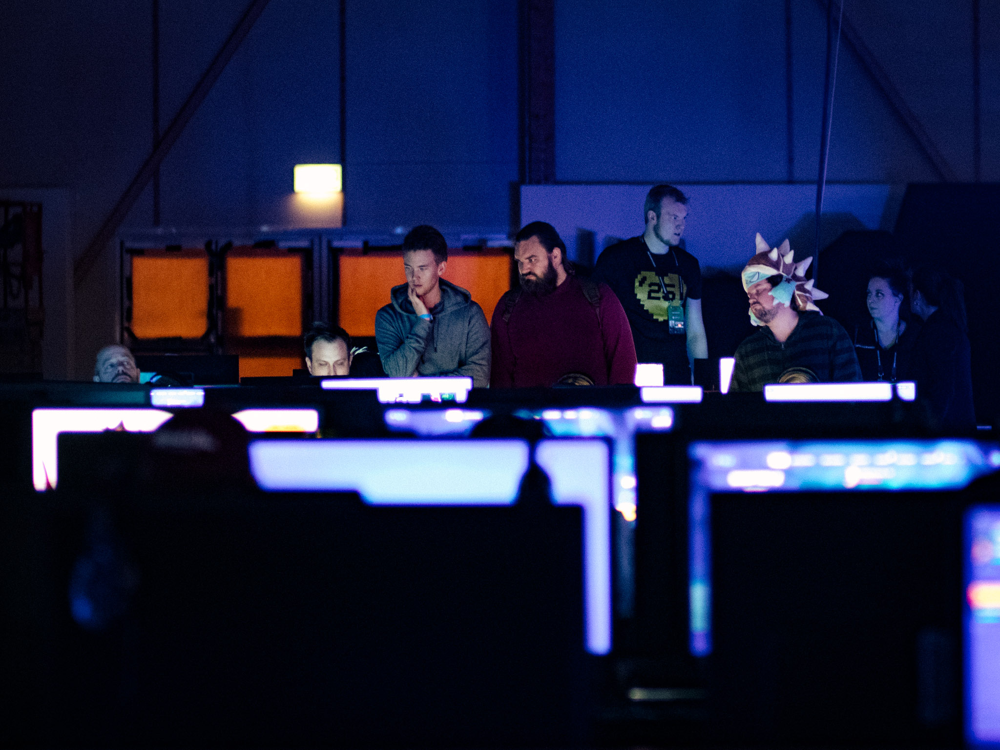

I try to pay each Dreamhack in Jönköping a quick visit. I find it's a good way to get a feeling for the state of gaming through game showcases, esports, and hardware. This year it was the 25th anniversary and it was bigger than ever!

One thing I did notice when going through these images is that they were all quite hazy. Sure, I hear it's common when using the lens wide open but the speed booster is most definately at fault here as well. Luckily Lightroom has a good dehazing feature.