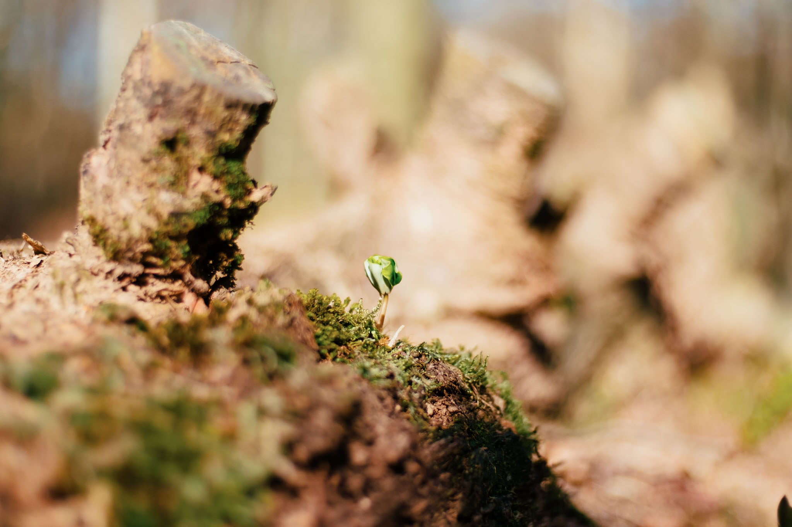
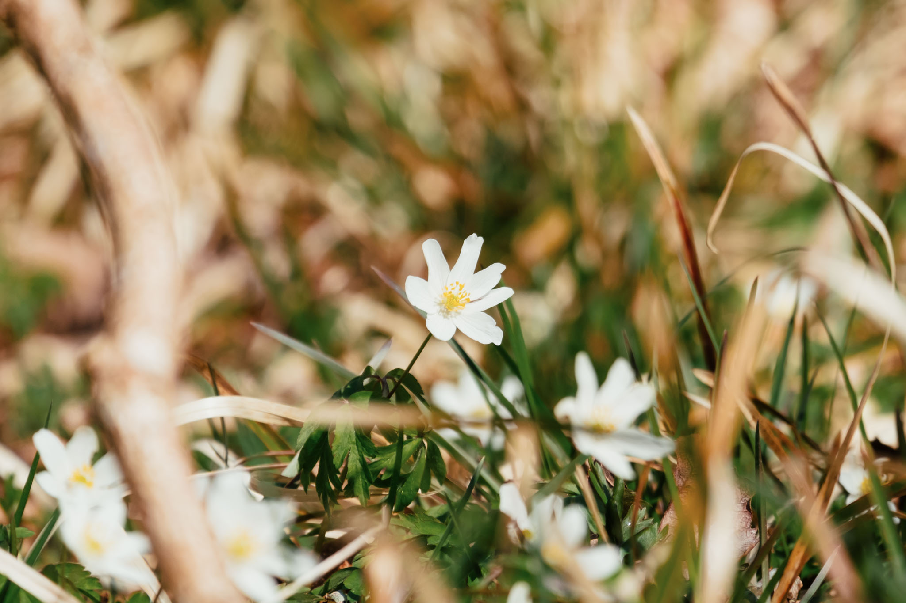
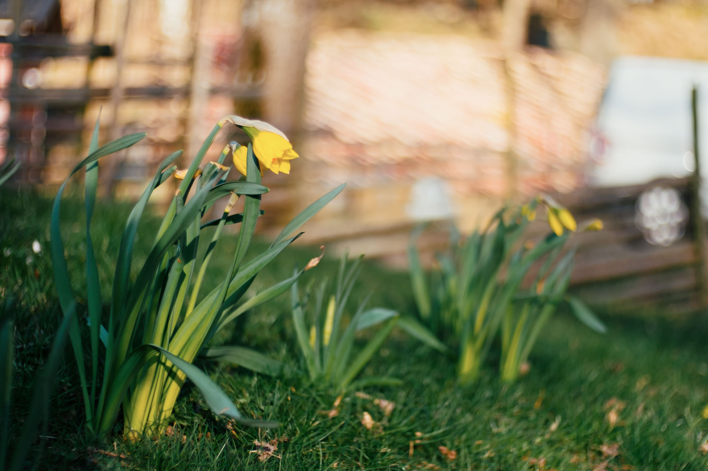
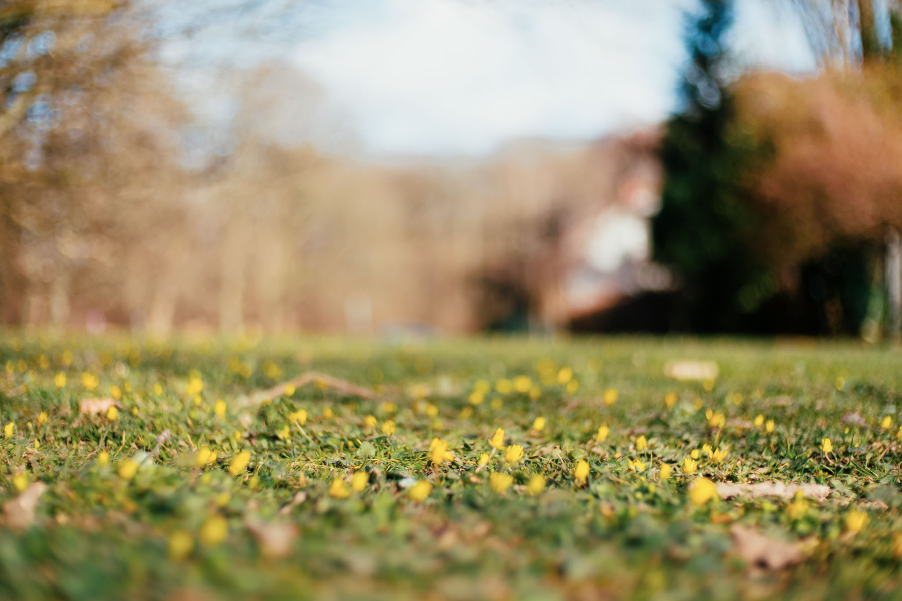

I've continued using my Canon lenses with the Viltrox fullframe speed booster on a cheap $100 Fujifilm body as I like the dreamy look so much. It's surprisingly light and complements the 7Artisans well when you want autofocus.

Greeted by yellow just in time for easter!

