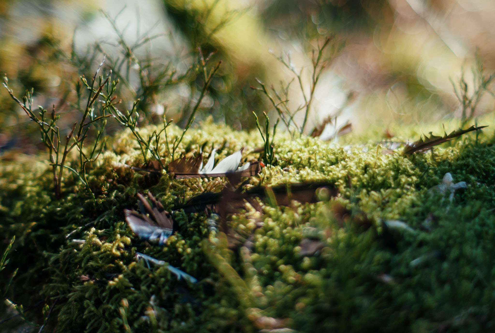
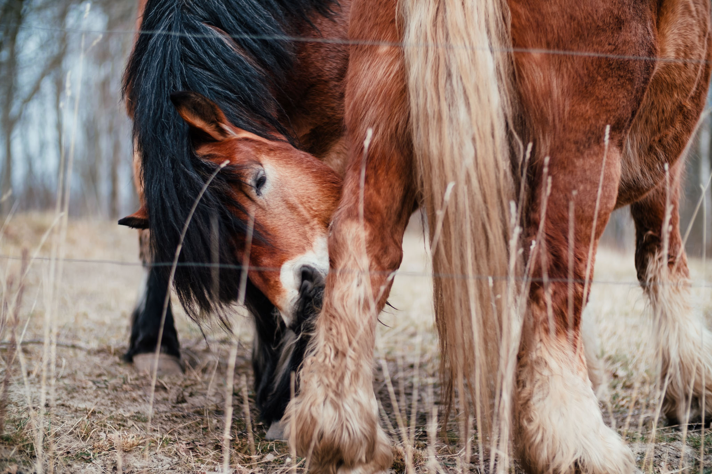
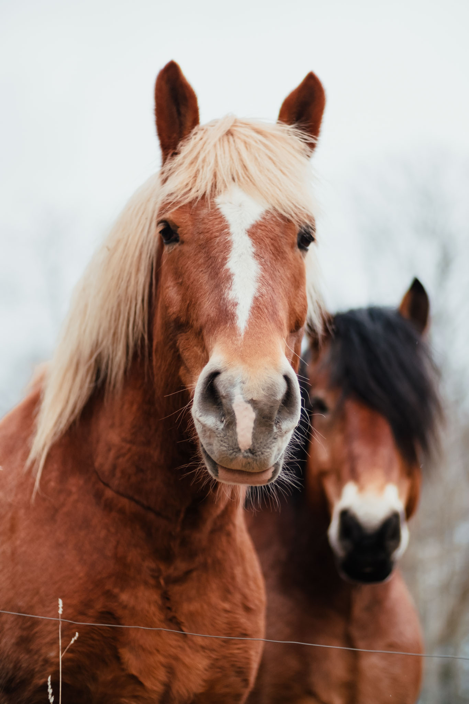
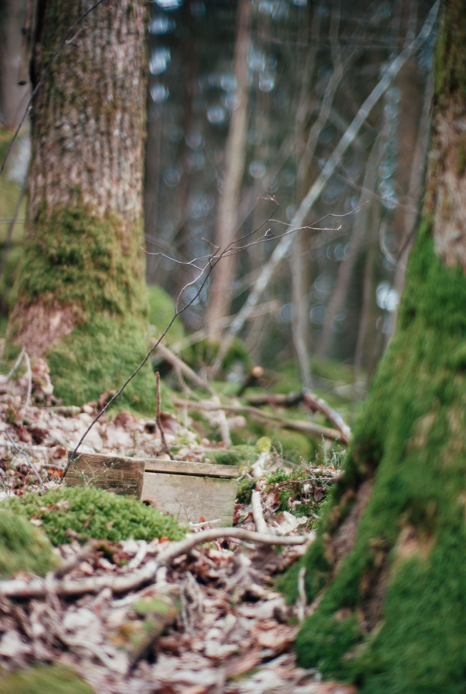

To be honest, I encountered little wildlife during my time in the forest this spring. There were some deer, but I never quite got any good photos of them. All I got were their ticks!

The horses belong to Gunnebo Ryttarsällskap.

