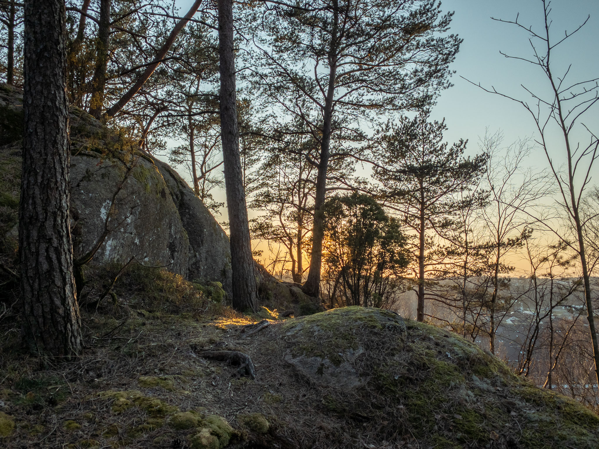
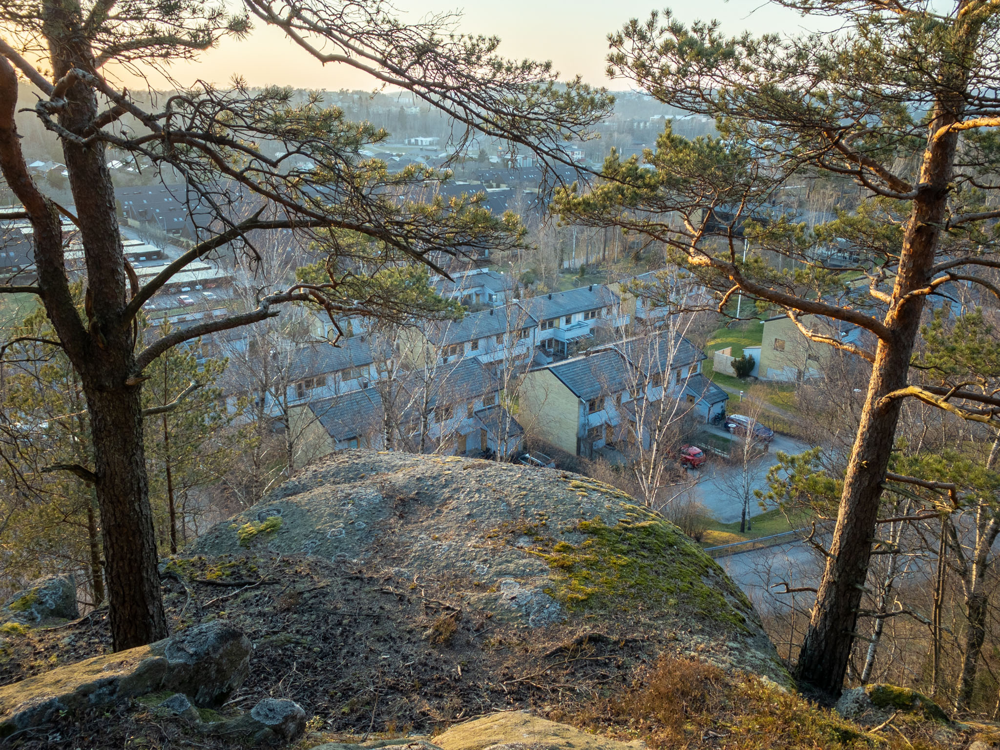
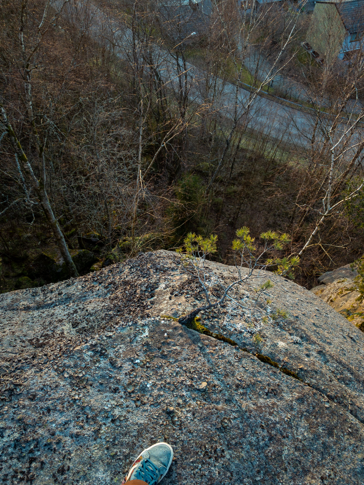
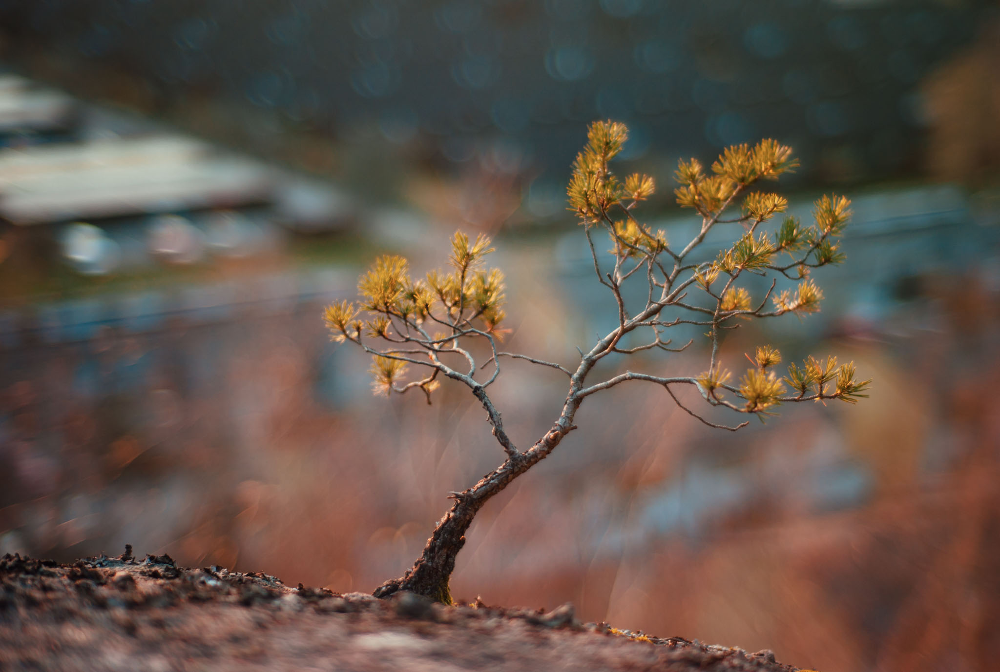

I've been back to this spot in Sävedalen several times since I found it on this occasion.

The Lightroom camera on iOS takes great HDR photos, but they're very hard to edit as the sliders don't start out neutral!

Here's my favorite lens, the 7Artisans 50mm f/1.1, opened up to full (above was somewhere around f/1.4, I believe). It really changes character drastically between these two values! The subject glows more while the background gets its own structure and becomes sharper in a way. Some don't like busy bokeh but I very much like how this lens does it, especially with foilage.

