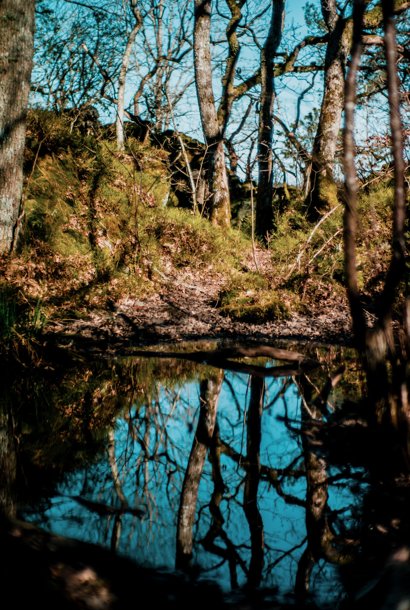

More discoveries this spring; a very pretty stream in a small ravine close to home, a hill in Billdal's park with a nice view of the archipelago, and the beautiful area around Bertilssons stuga at Lilla Delsjön.

