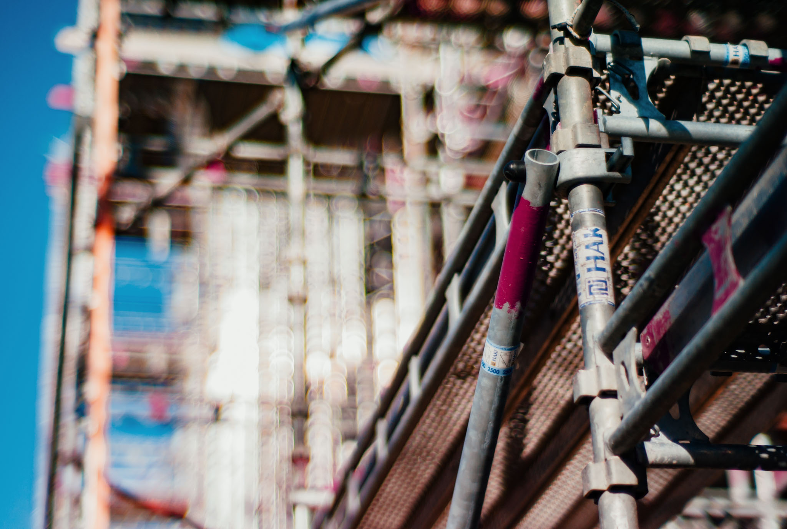
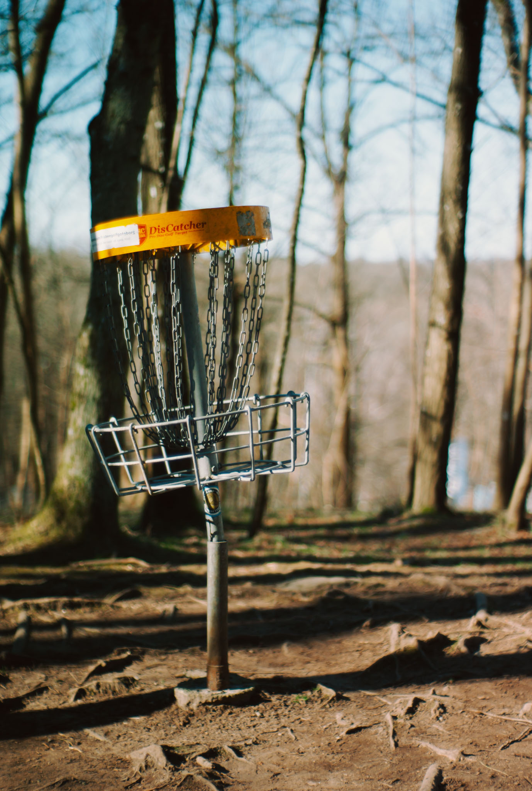
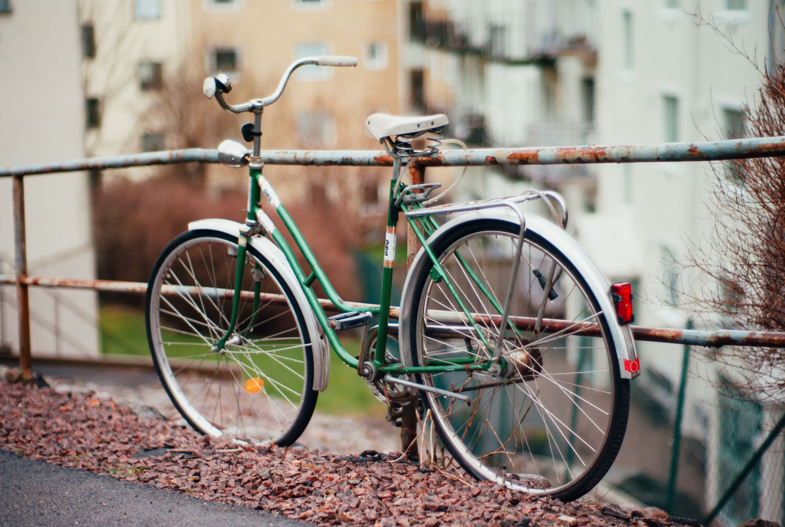

Been to any nice bars lately? 

I took the relatively affordable and awesomely flawed 7Artisans 50mm f/1.1 and visited these! ...kindof miss the kind where you can get a drink though. It's been a while.

