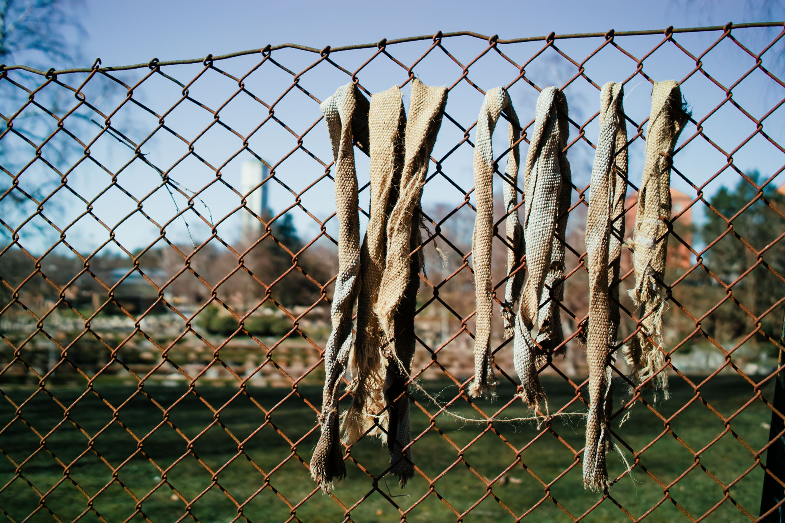
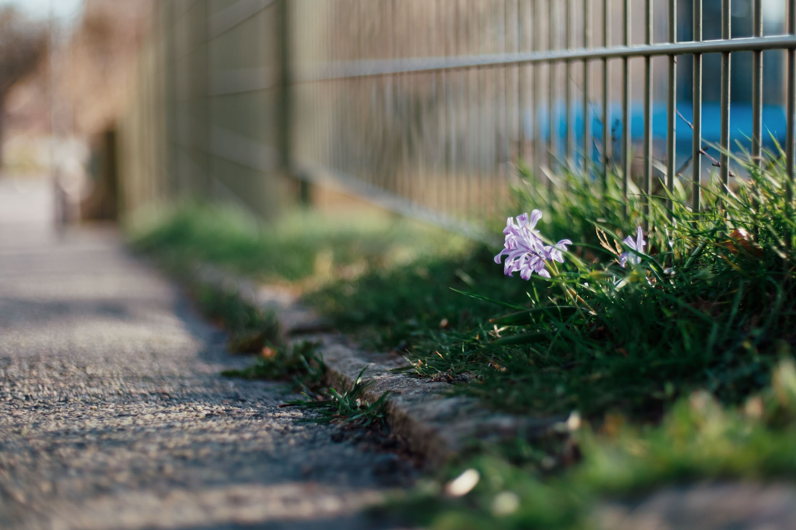
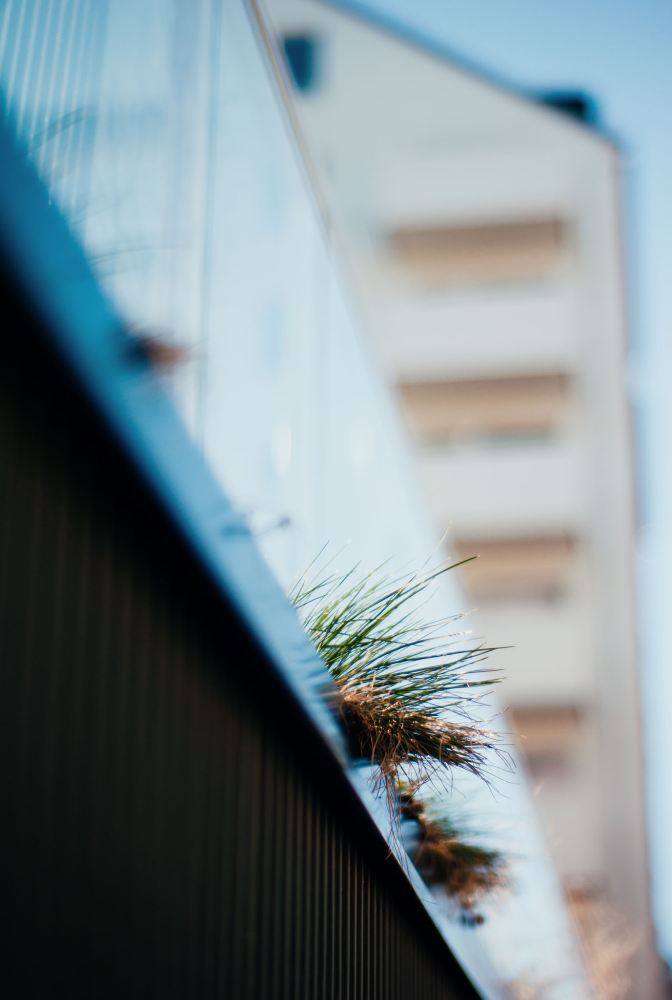

I take a lot of runs in the neighbourhood and sometimes bring something pocketable. Some of these were taken with a Sigma DP2, a wierd old digicam that I got for cheap. It's neat but white balance is often off and hard to correct..

