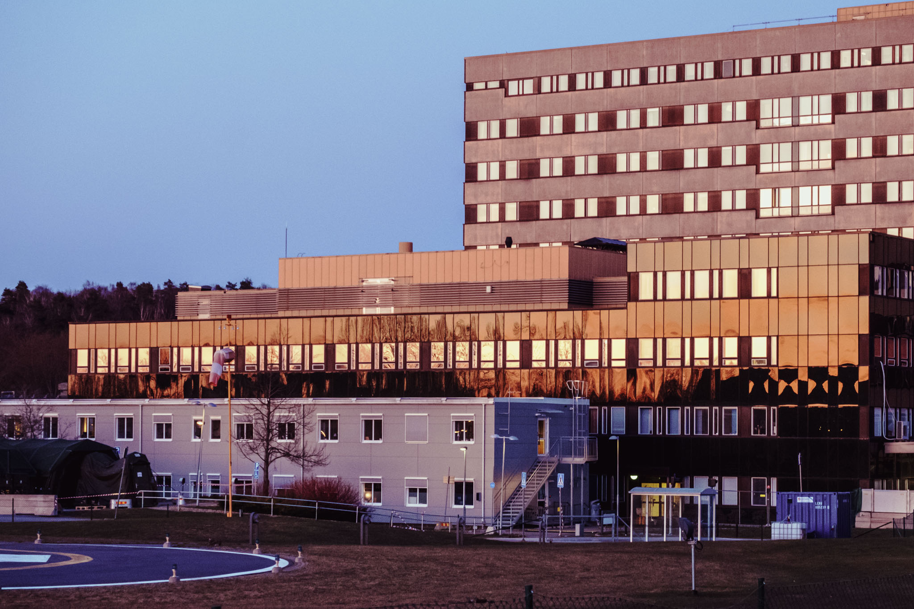
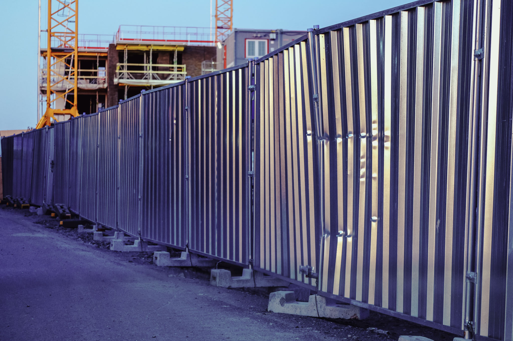
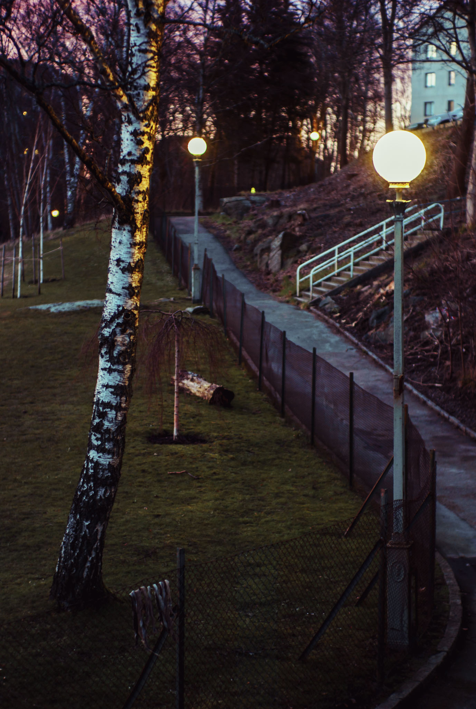
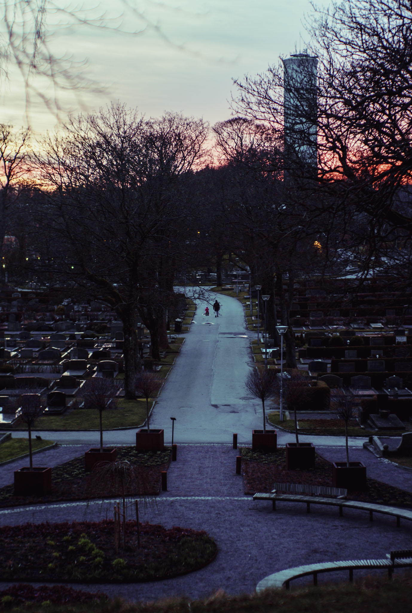
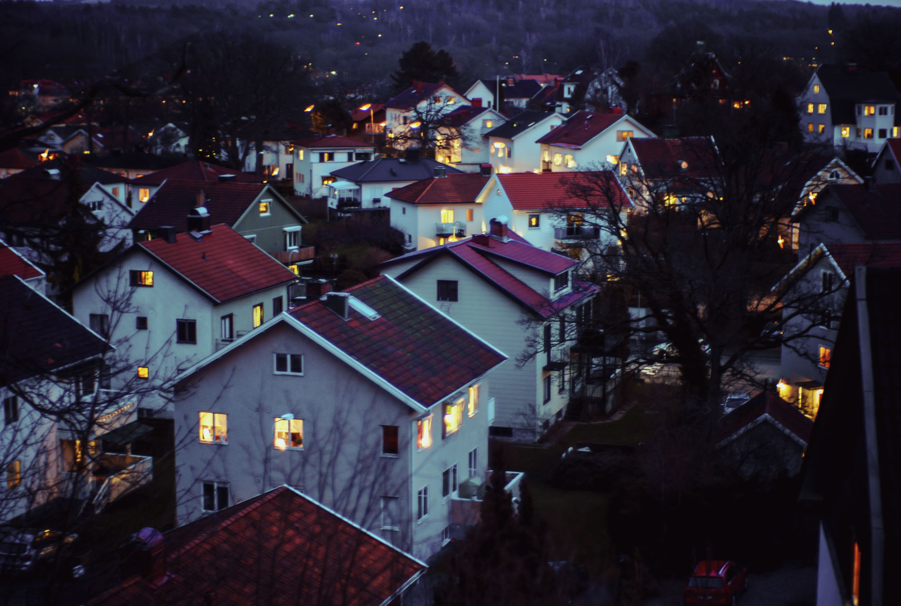
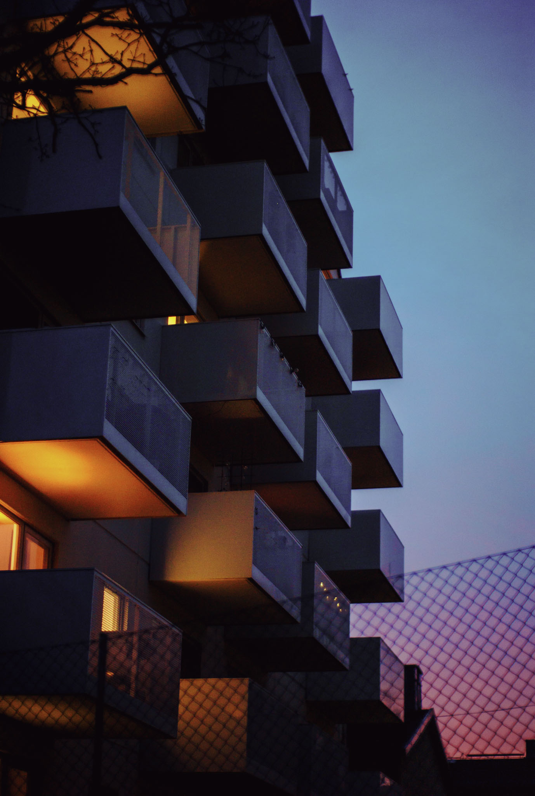

The strange winter turned into an even stranger spring. I've kept busy visiting the less busy places. Spending time alone with a camera, in the forests around here in particular, has really kept my spirits up.

