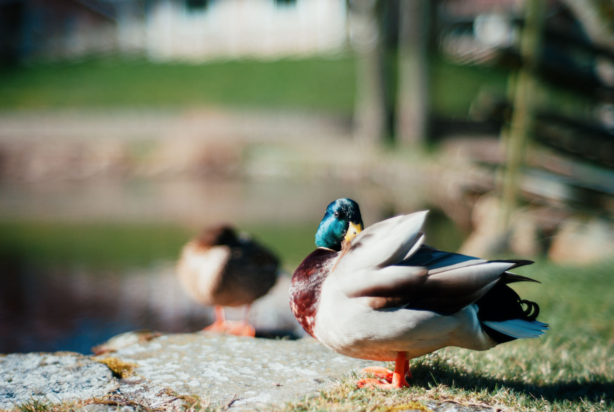

I took these during a March morning walk.

I never thought I'd own a Leica but if they're old (2006) and broken enough they can be affordable! The colors are something extra, even after post-processing, and it the perfect match to the 7Artisans 50mm. 

