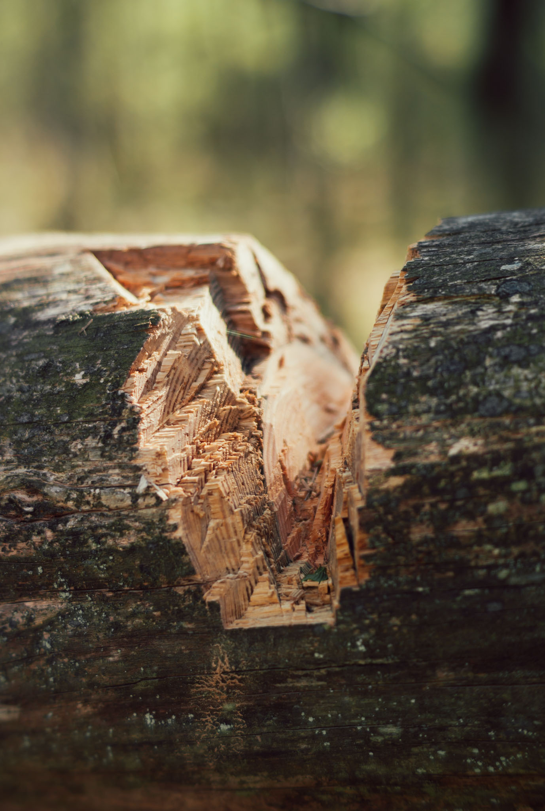
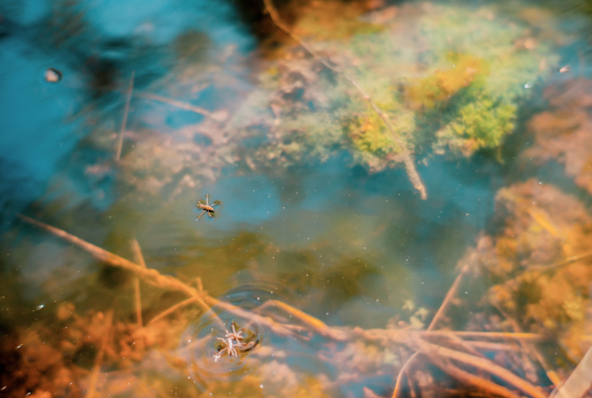
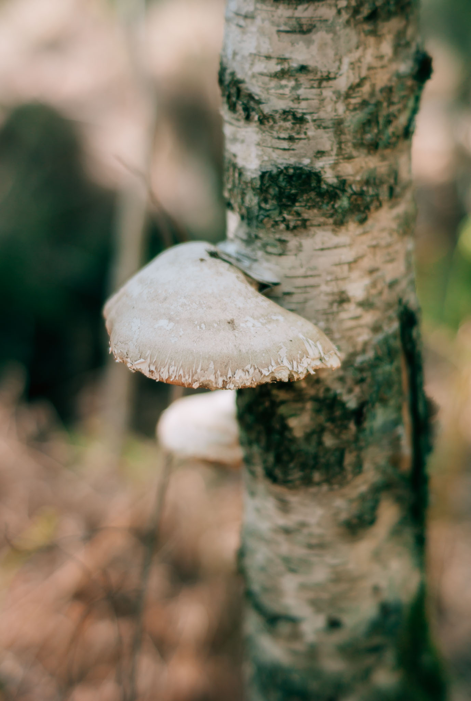
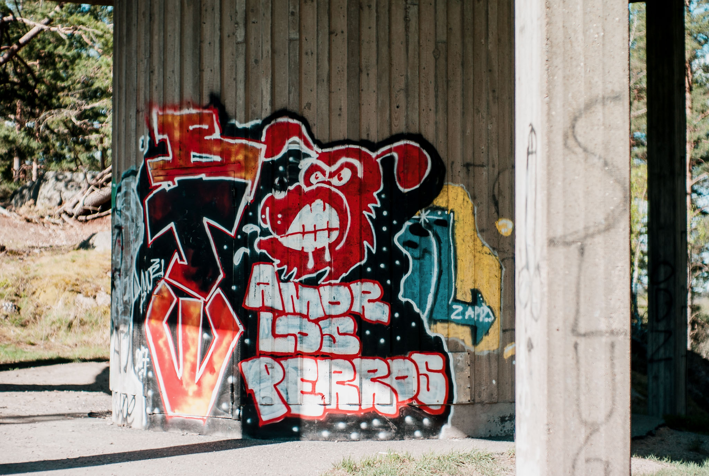
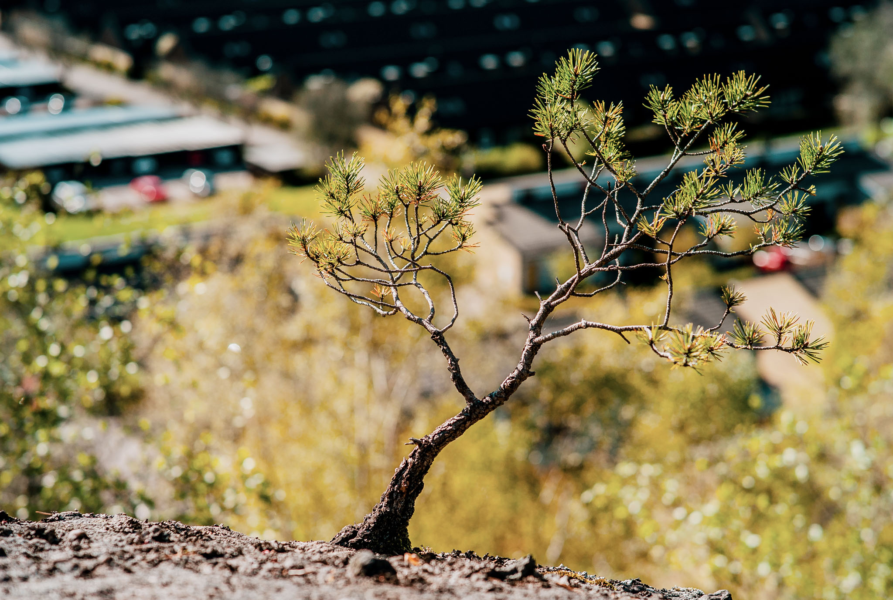
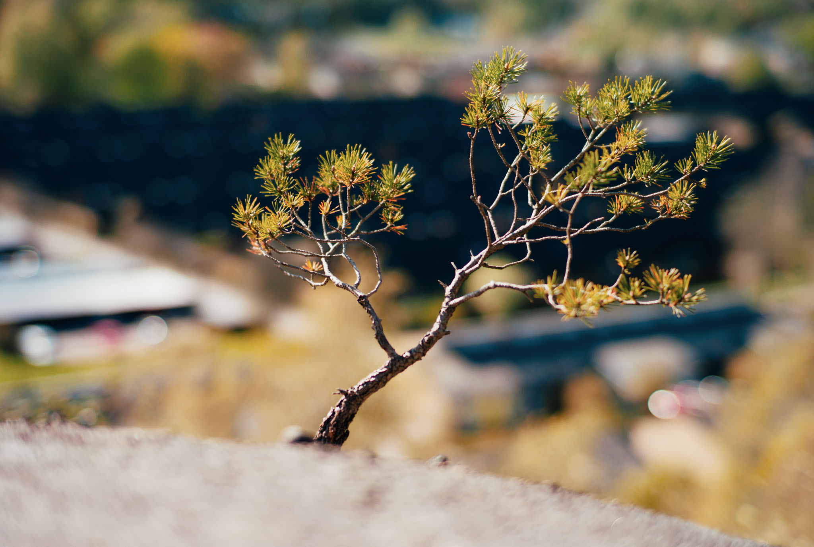

A nature reserve close to home. I love to chill here on the hills. All shot with my beloved, slightly busted Leica M8 with my favorite lens.

You probably recognize this little guy from the Heights photo set as well. 

