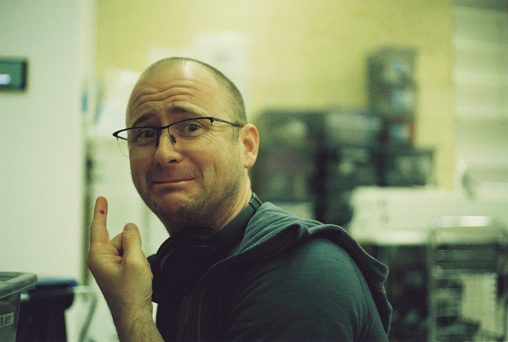
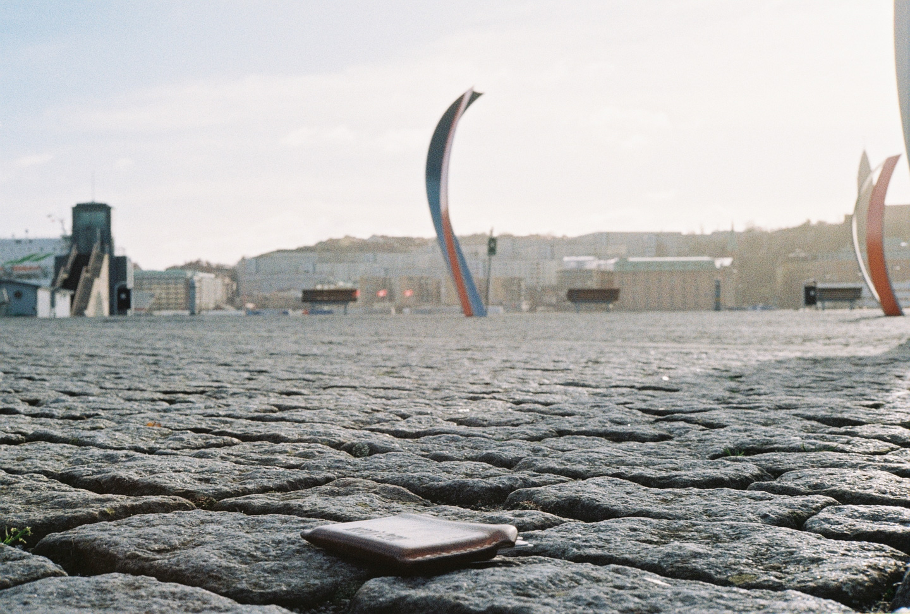
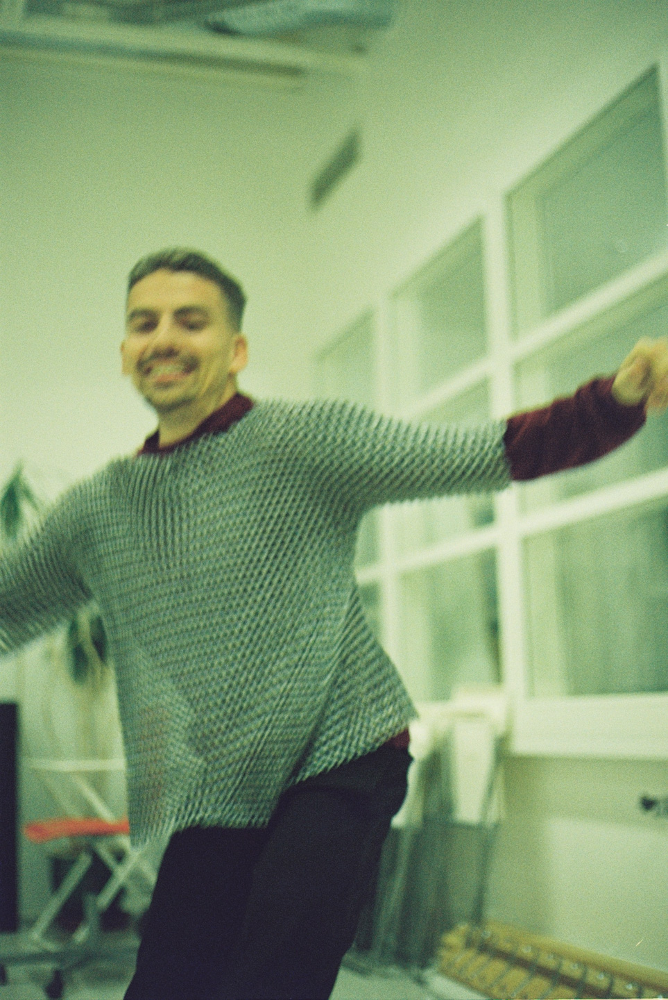

Every photo captures a moment, but some of these were extra passionate, unlucky, fun, or fortunate. Speaking of which, who could possibly have dropped their wallet and was relieved enough to take a photo upon finding it?

