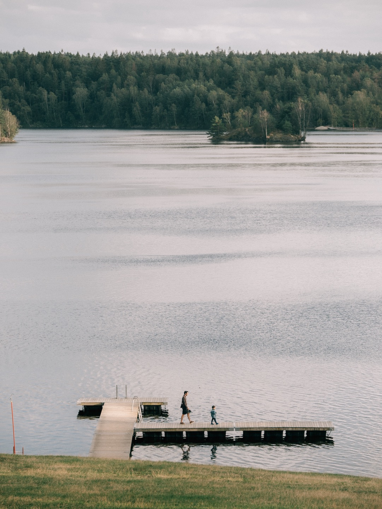
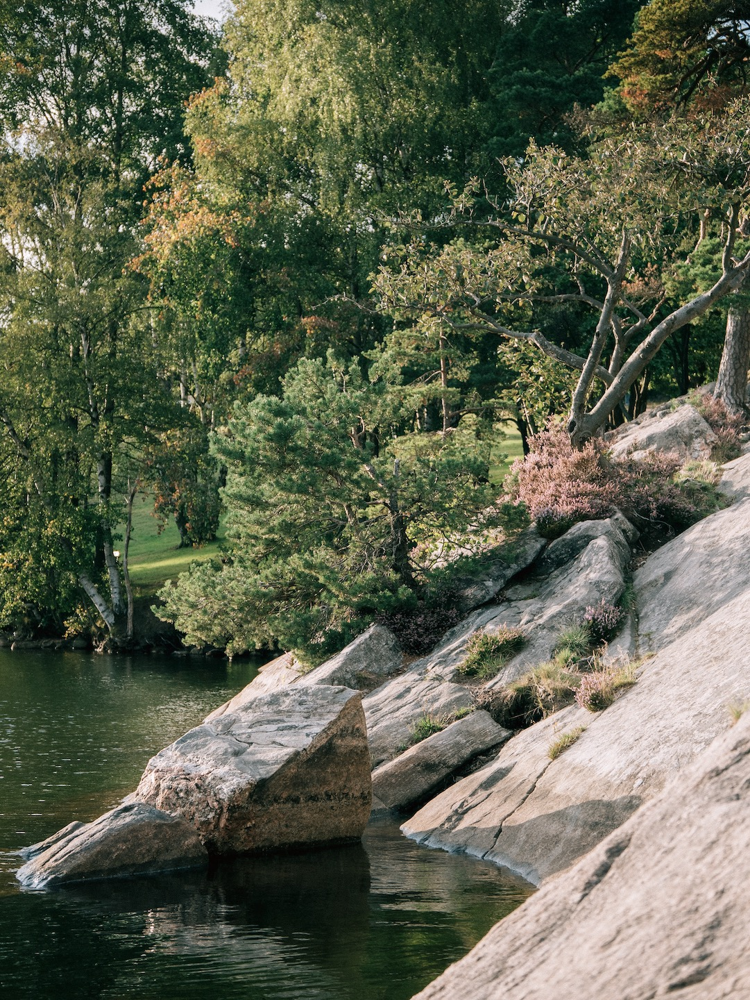
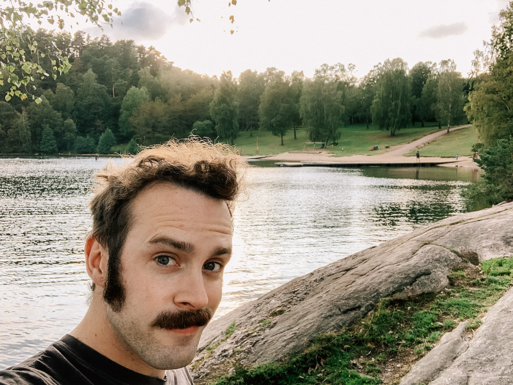

The darkest day of the year is near so here's a throwback to August and the second-to-last swim of the summer. Also an excuse to use more of that lovely Kodak Gold preset from Jamie Windsor, whose film emulations I find so inspiring!

Panasonic GM5 with the 35-100 lens. It's thanks to the size of this combo that I managed to bring it to the lake in the first place, it fit right in the pocket of my jacket!

