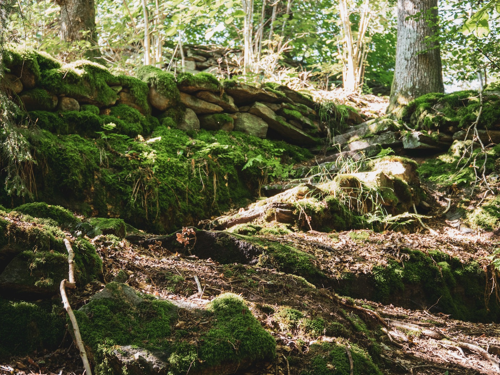
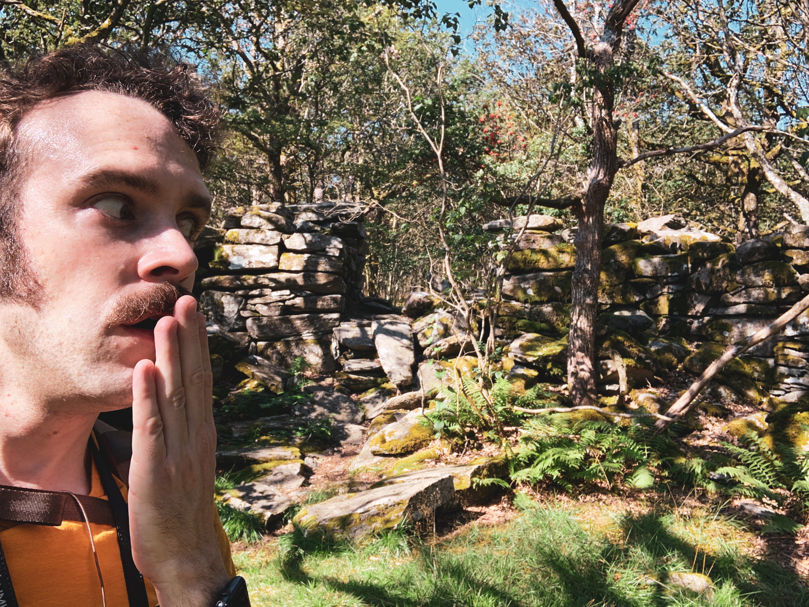
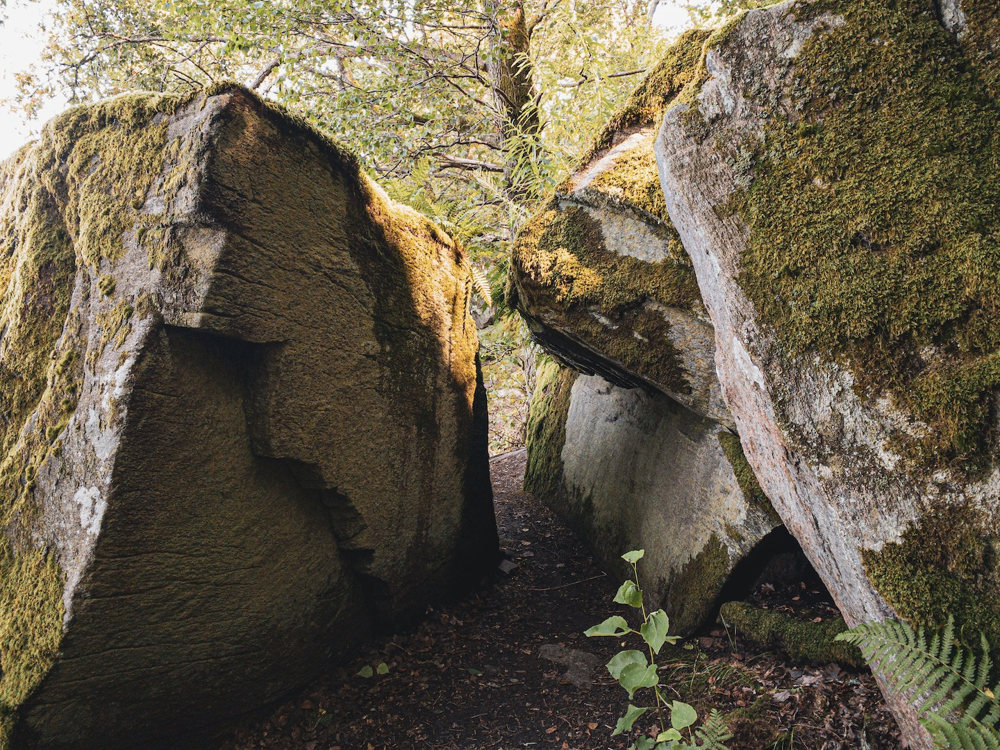
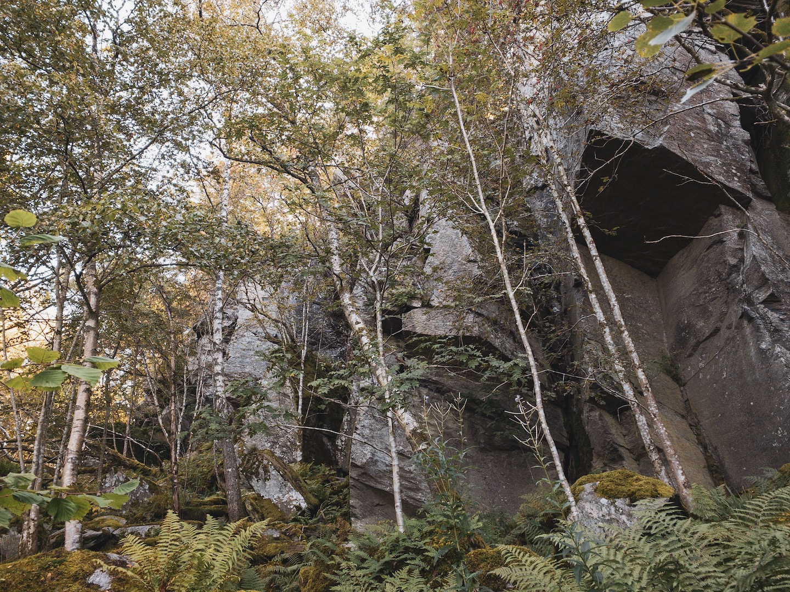

Another throwback, another lake. The last swim of the summer, at Rådasjön with an old quarry and a fake 19th century ruin! A bit different look to these as I had a different process at the time.

