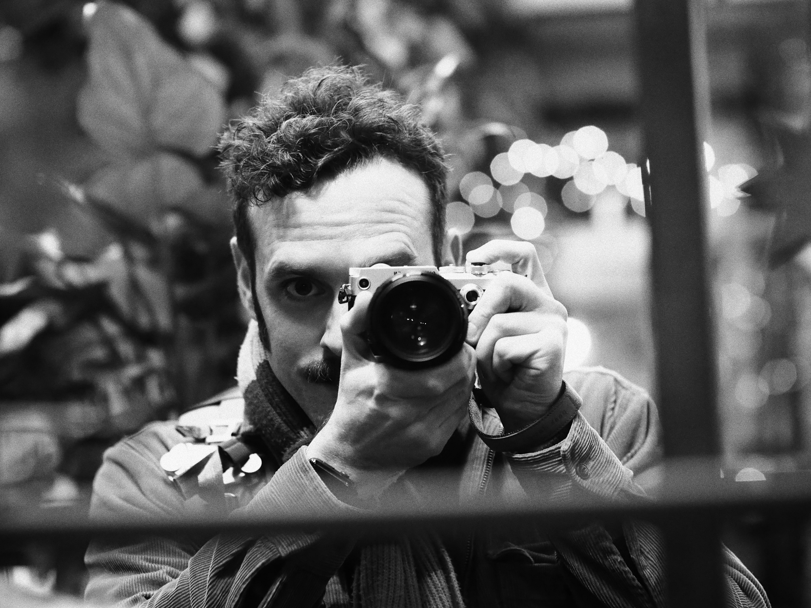
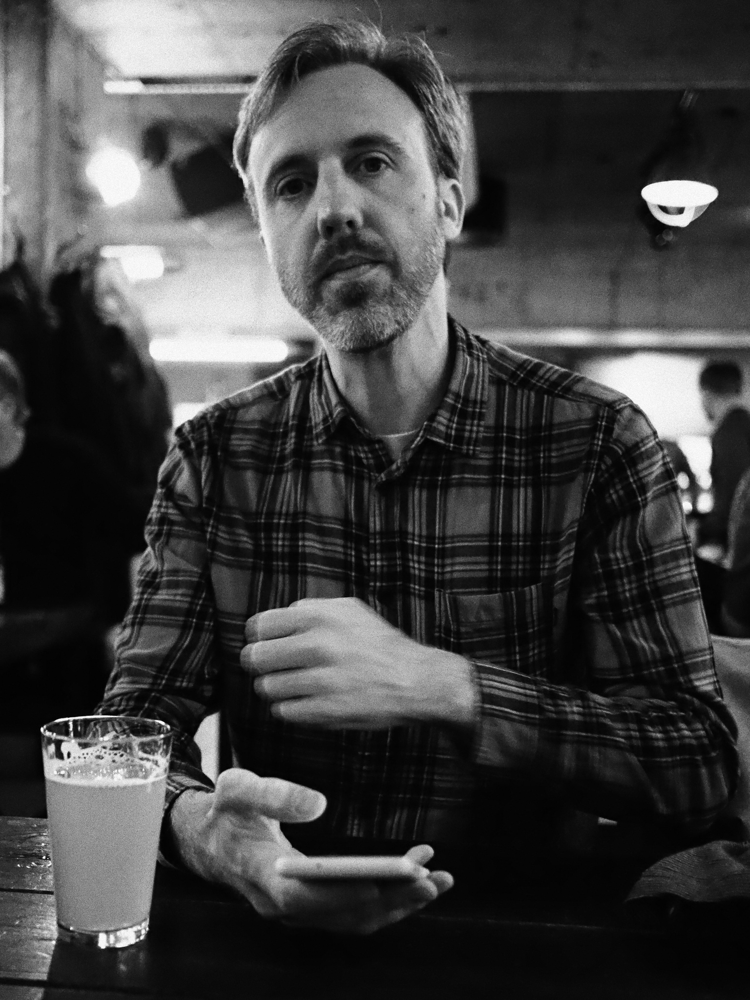
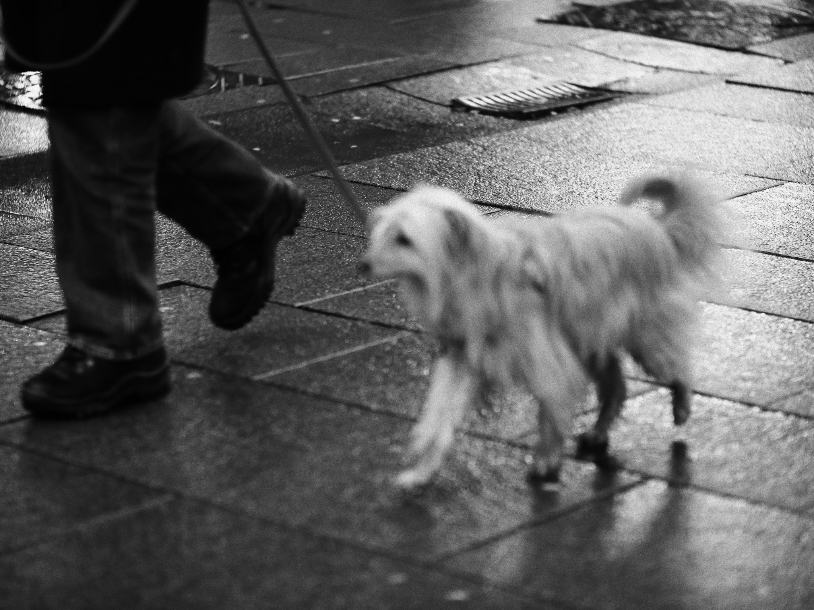
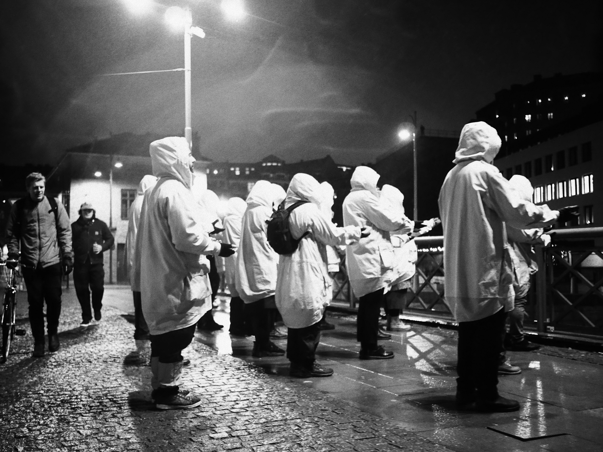
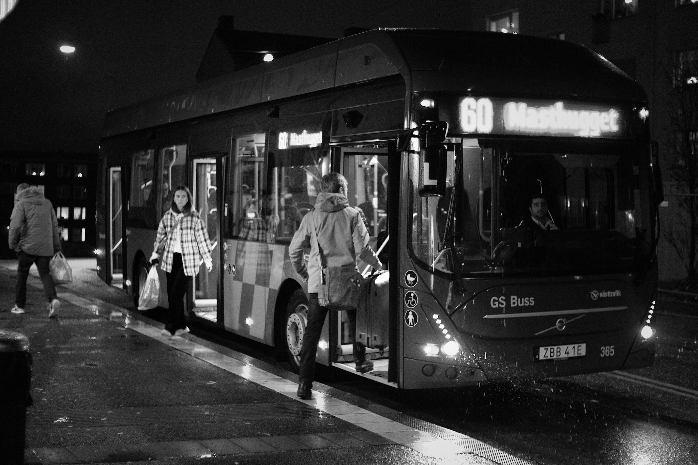

My good friend Mats came over from Stockholm and we had some fun snapping the city (and each other). Mix of my old favorite, the Canon EF 85mm 1.8 and new acquaintances, Panasonic 20mm 1.7 and the Olympus Pen-F. The latter's Monochrome 2 is great!

