On this day a year ago I visited Stockholm for the last time. I sold a camera and bought my beloved Leica M8, and also took some photos with both Fujifilm and the Yashica. It was quite a different world and I miss it badly!

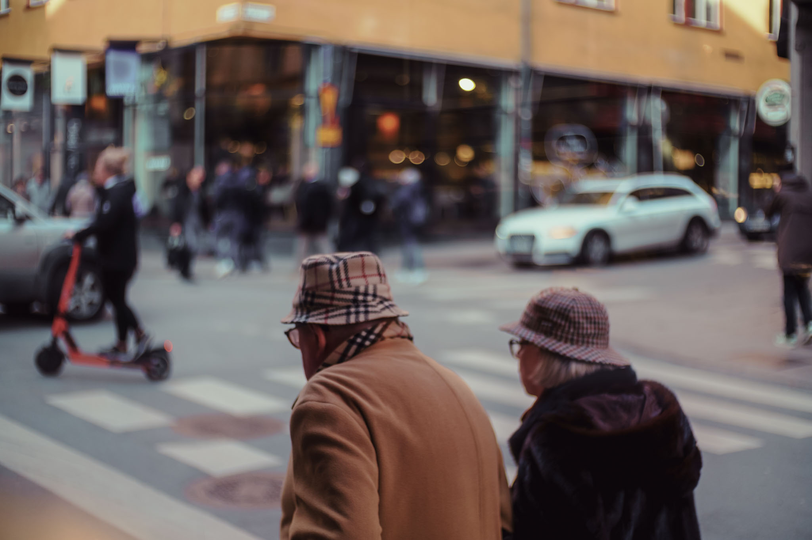
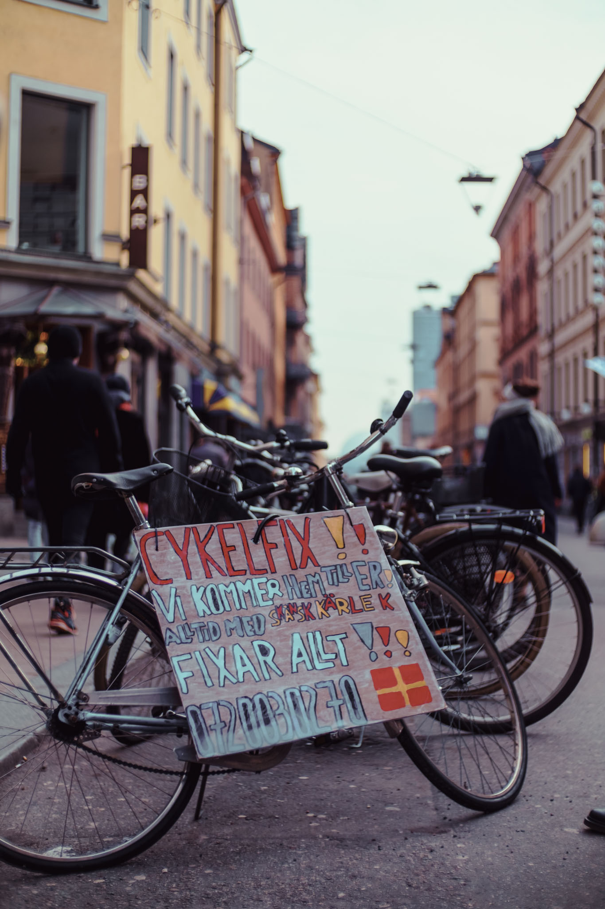
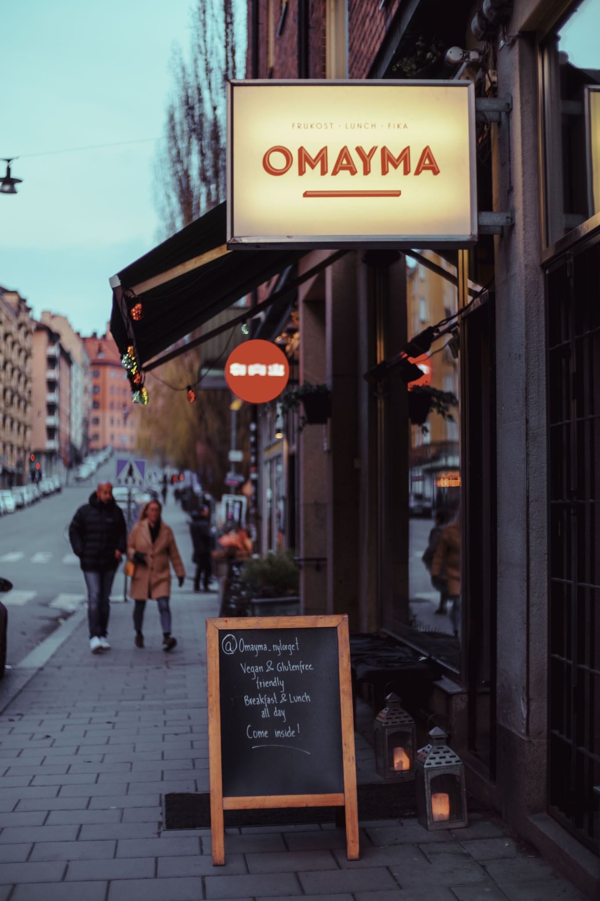
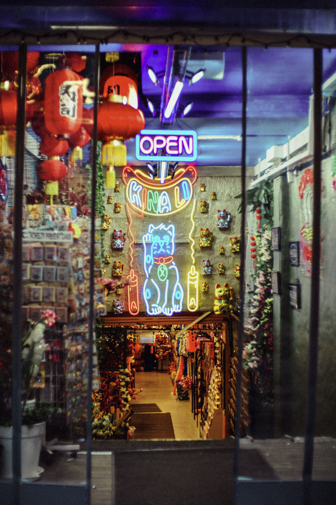
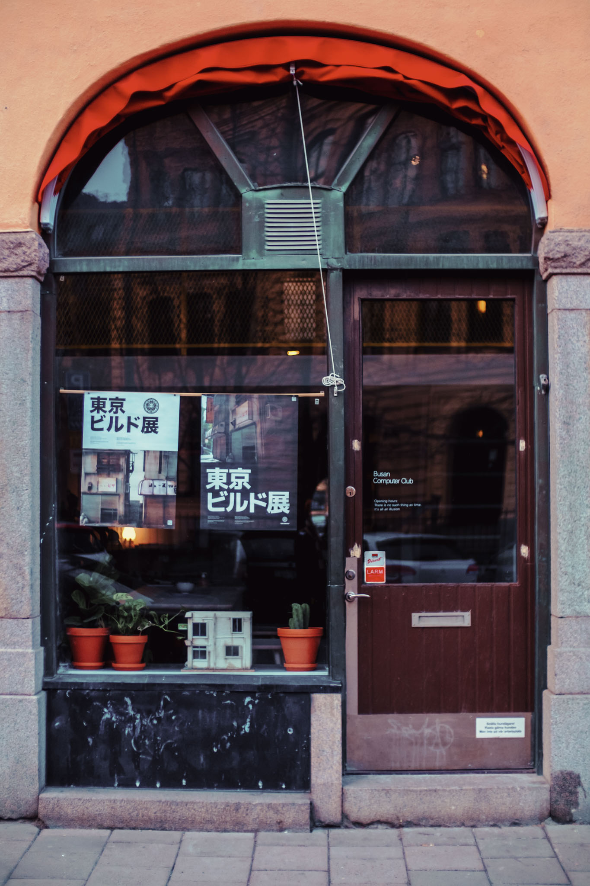
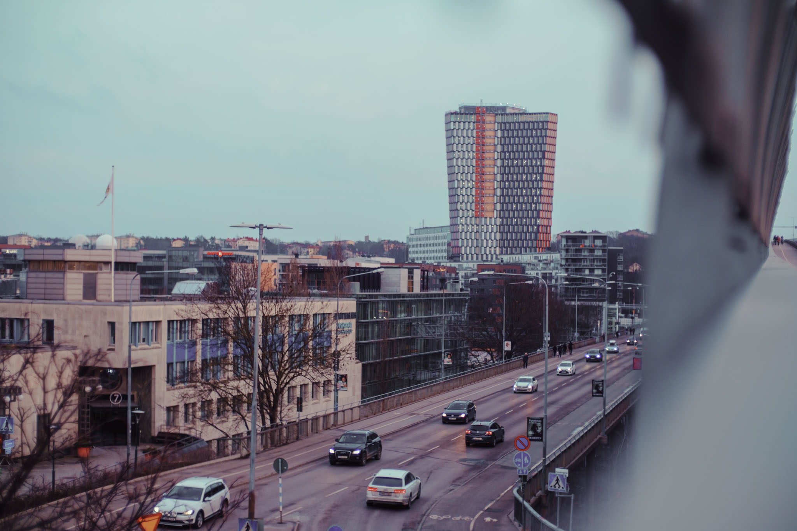

Here's the Yashica doing street duty. It's not the greatest rangefinder but I did manage to set focus pretty quickly.

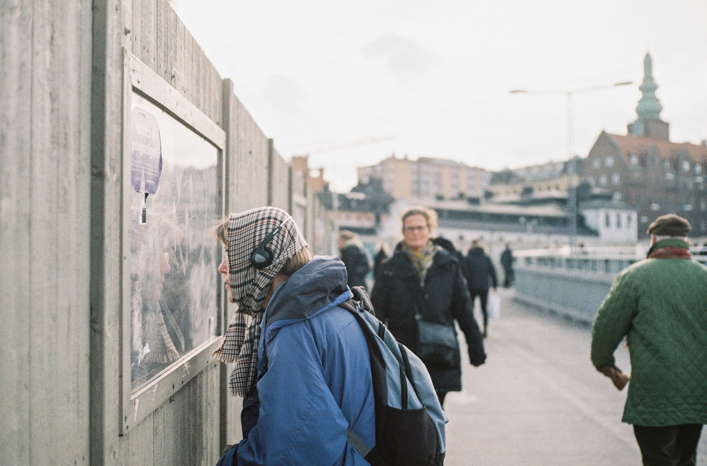
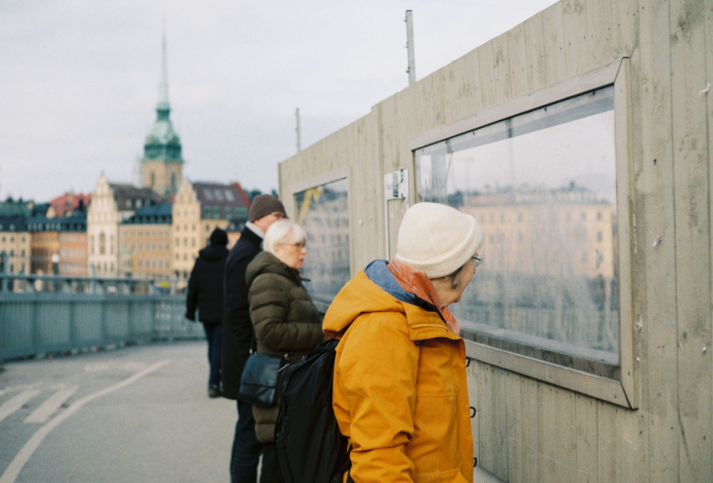
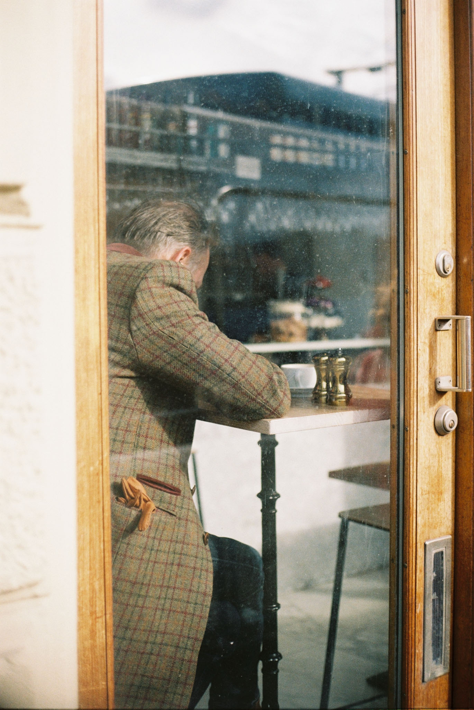
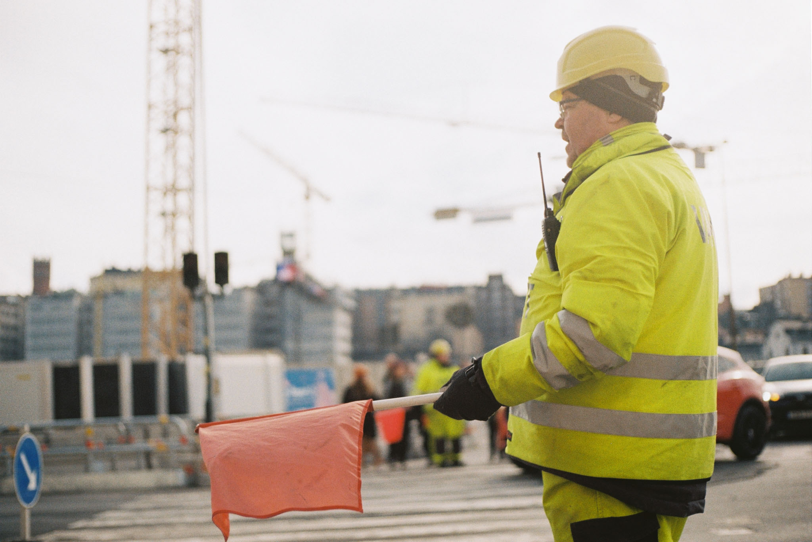
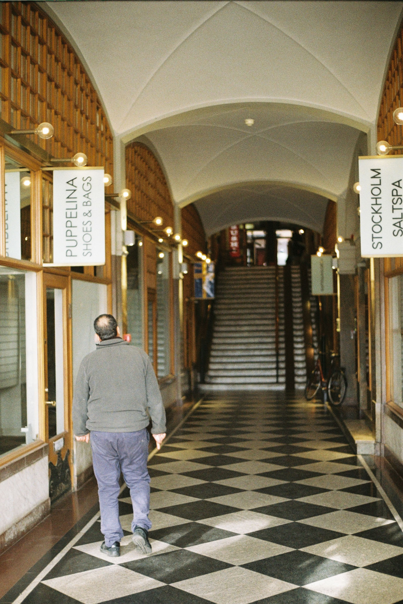
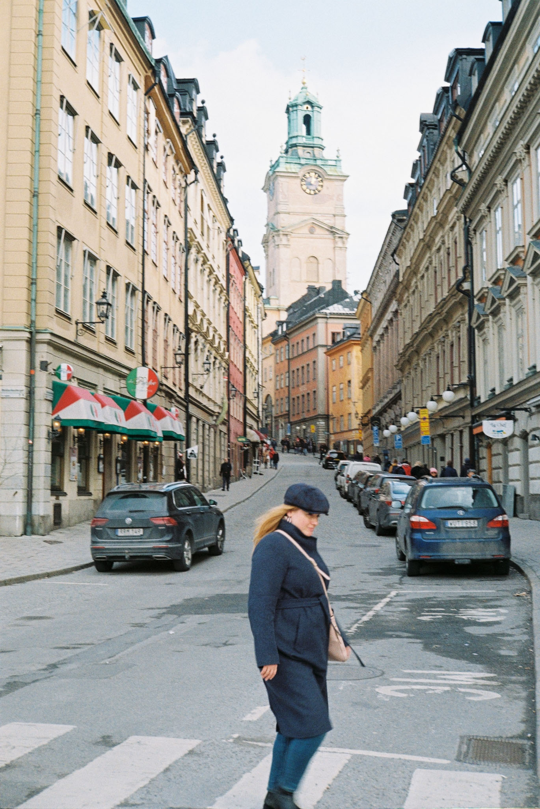

Ran into my uncle as well. :)

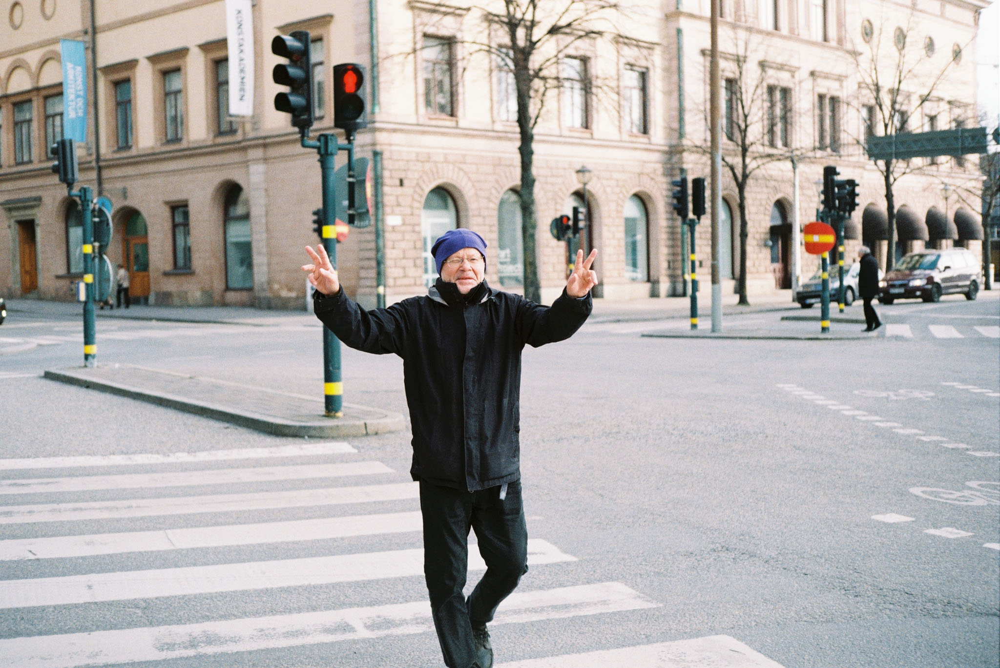