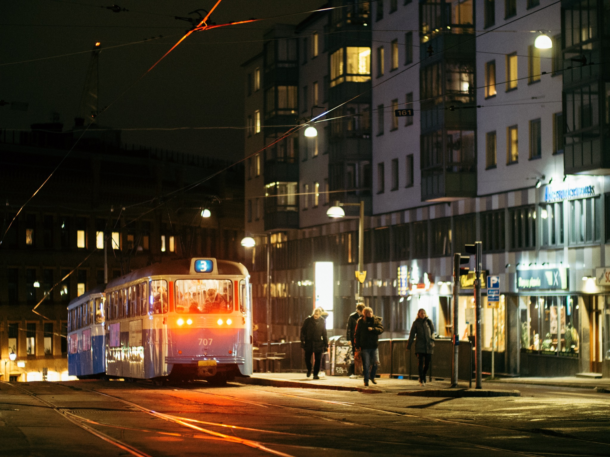
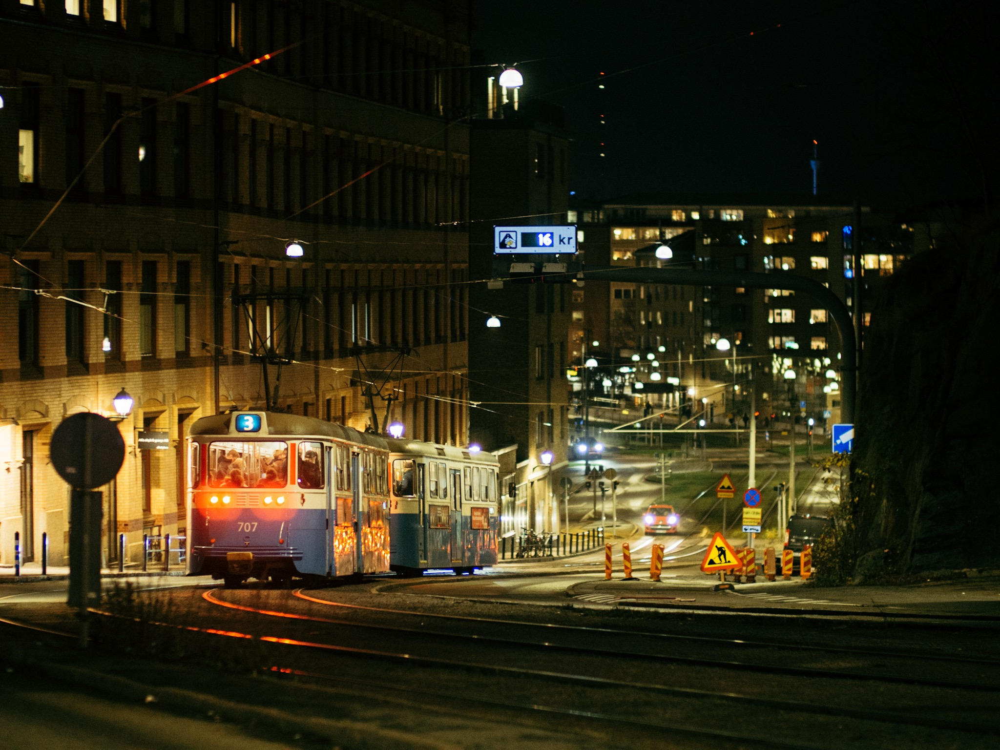
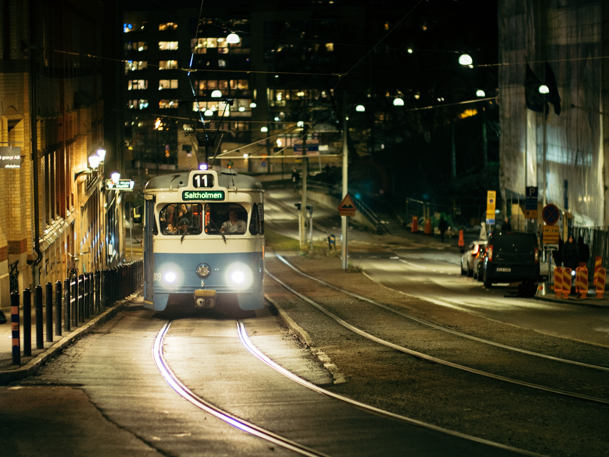
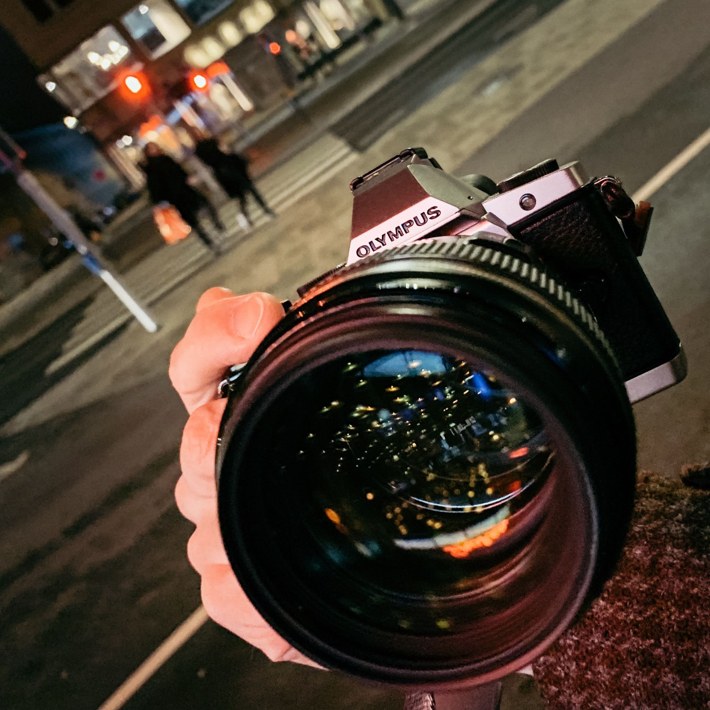

Our trams are such an easy target for nighttime photography. 

Canon 85mm 1.8 with 0.71x speedbooster (120mm equivalent), and Jamie Windsor's Fujichrome Astia emulation. Super happy how well these chunky Canon lenses work on my MFT cameras!

