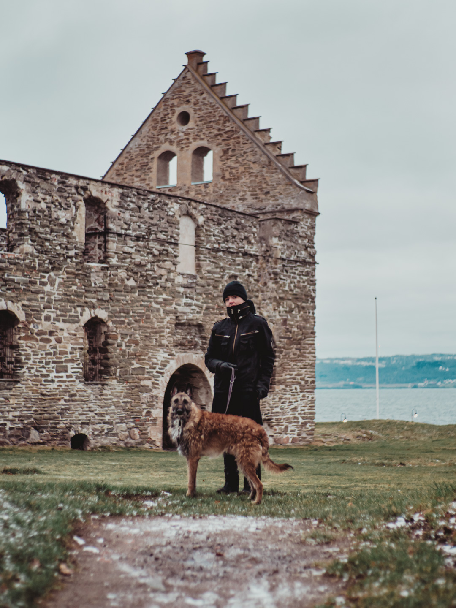
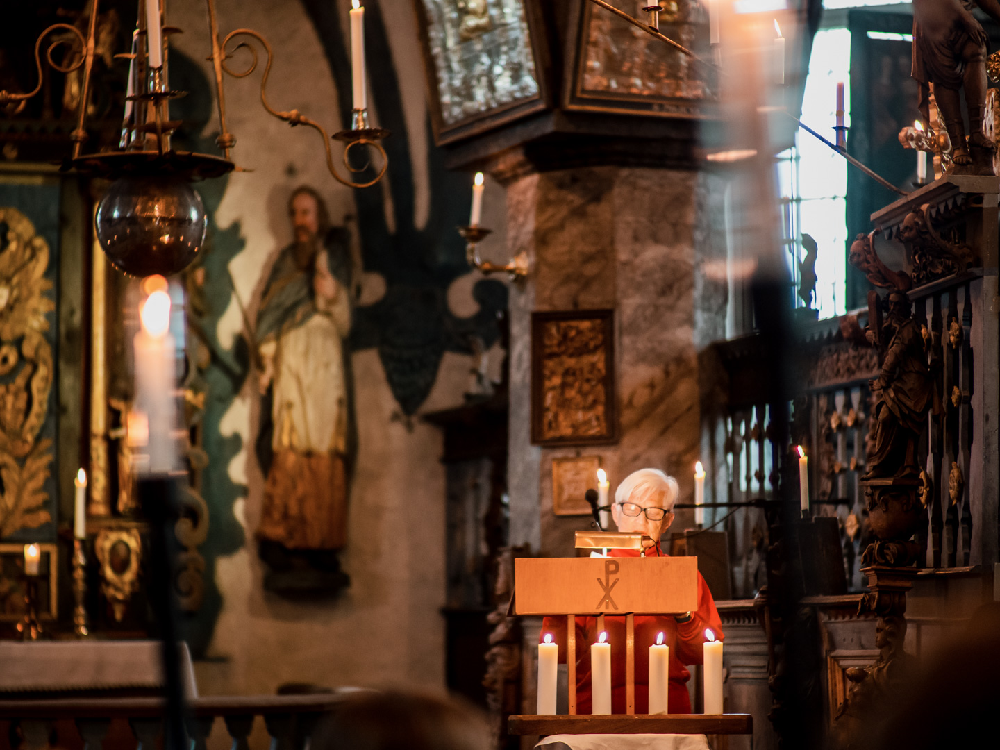
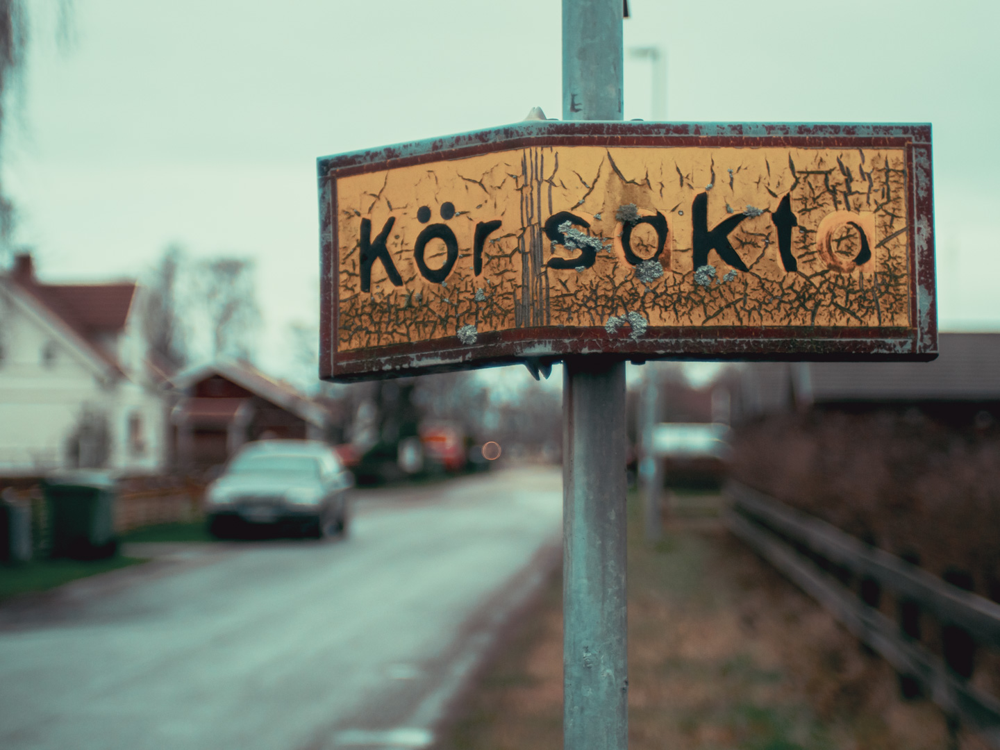
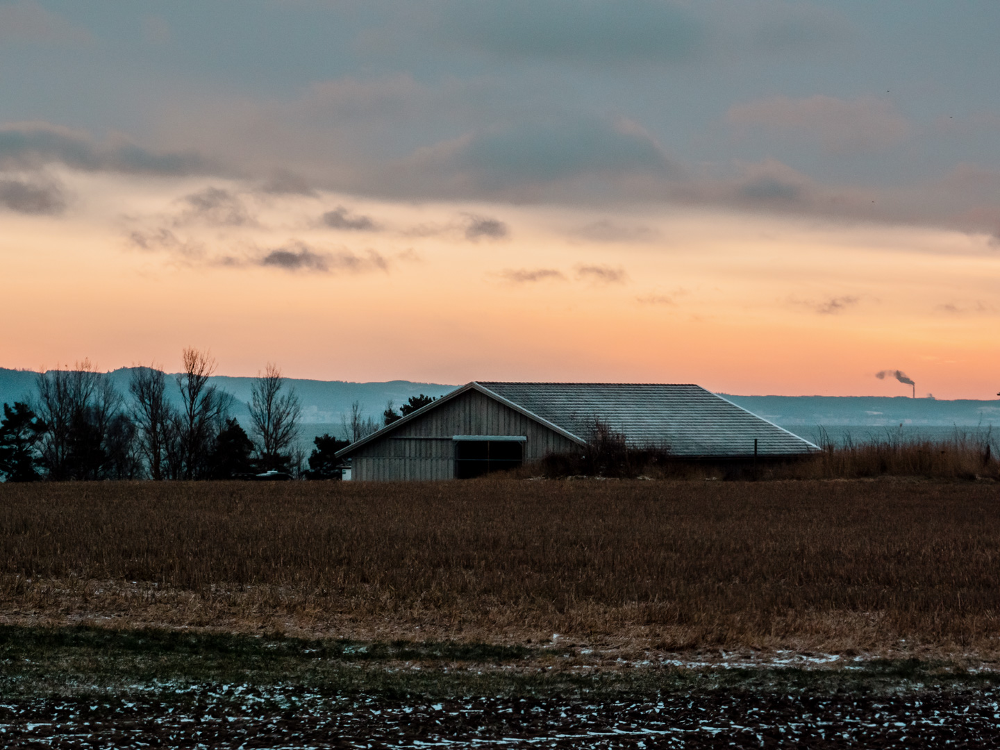
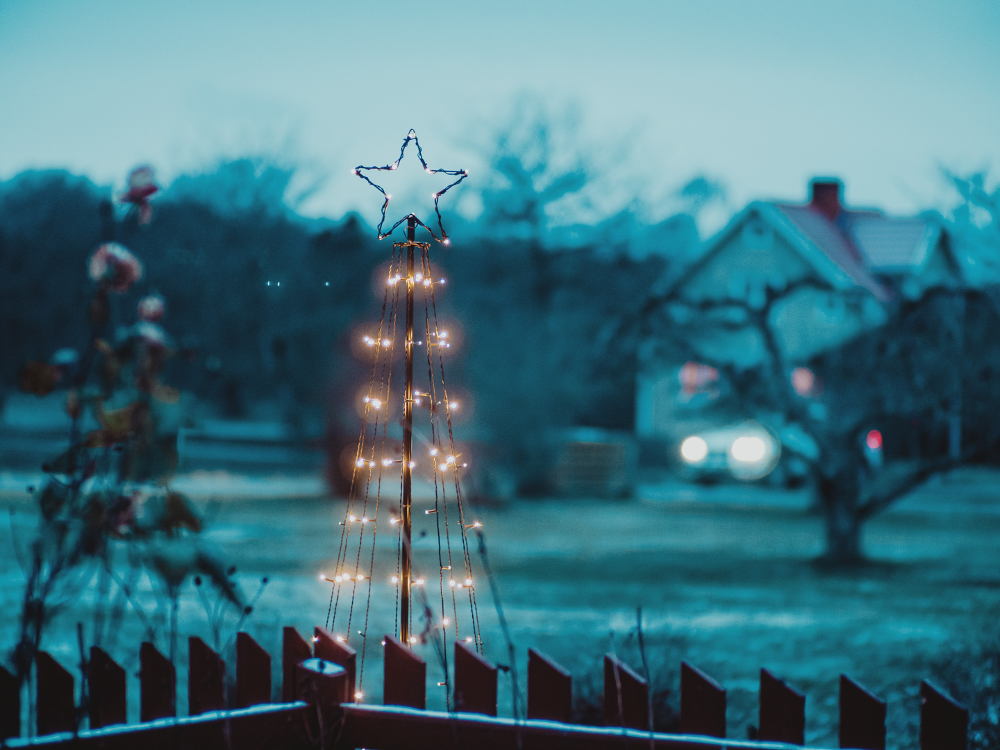
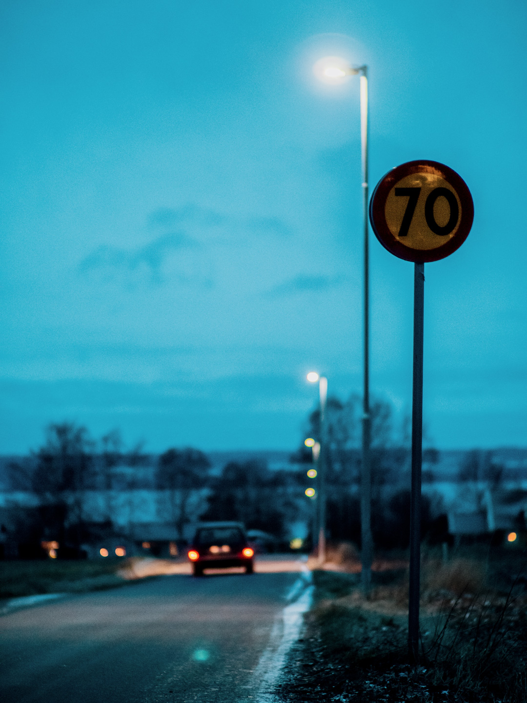
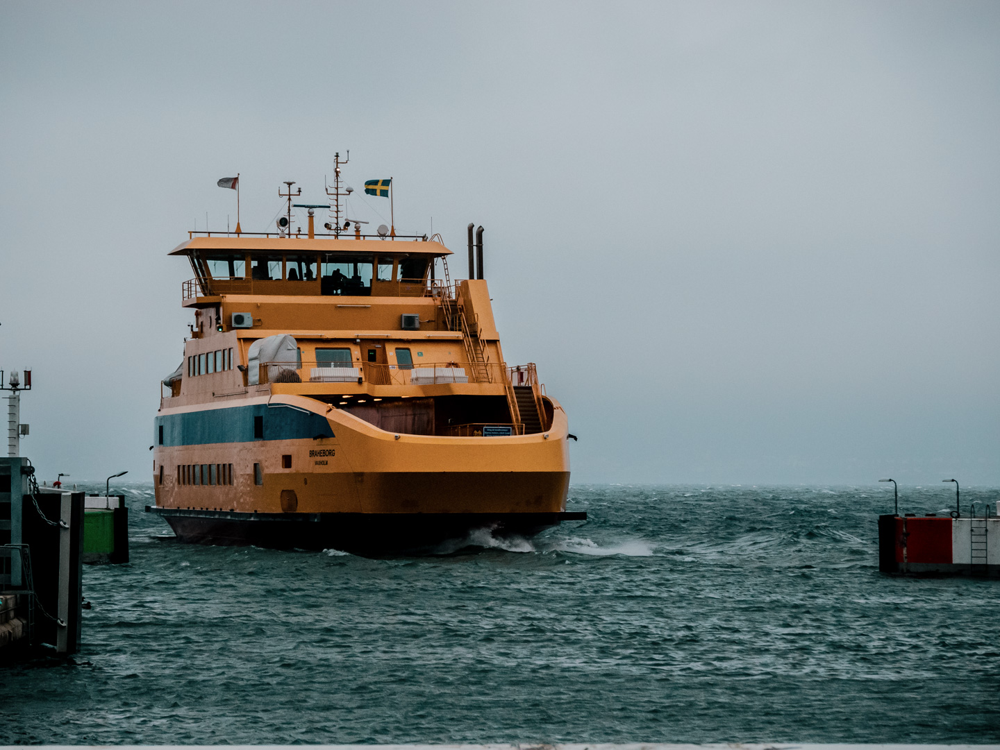
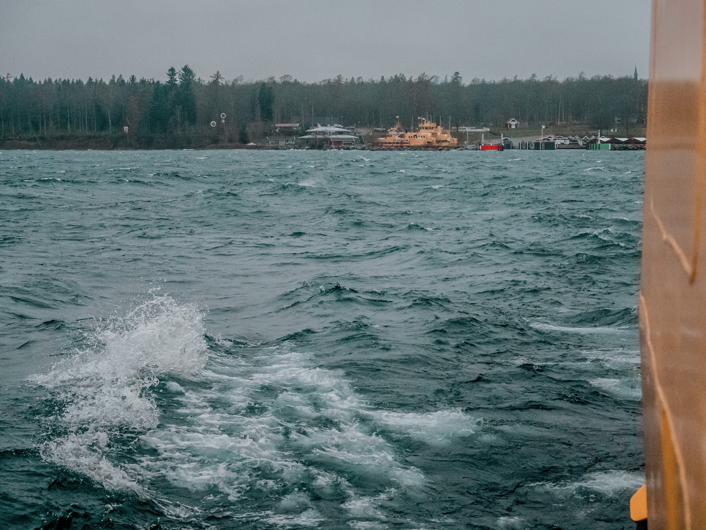

I had a very nice Christmas at Visingsö with family and friends, both two and four-legged. All of these were shot on my MFT cameras and use Jamie Windsor's new Kodachrome presets, which are surprisingly varied!

Part 2 is coming up soon!