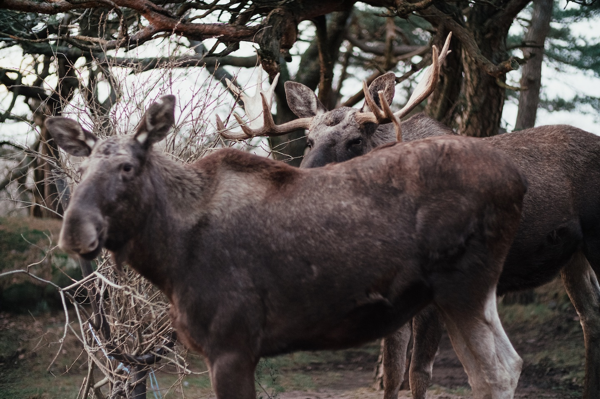
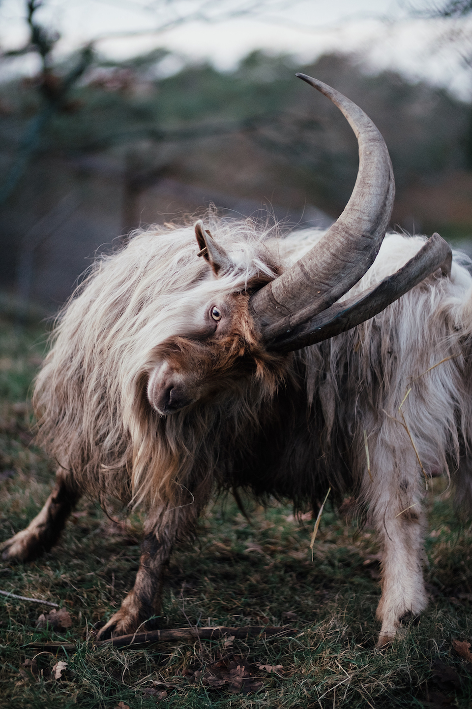

Slottsskogen is a gem, with its open air animal and heritage park, and I went there often back when I lived nearby at Masthugget.

Getting to try out a Fujifilm X-Pro 2 for a while with my Canon lenses. With the Viltrox speedbooster it's pretty much the equivalent of a full frame camera!