*English version below*

Jag la nyligen upp en [sammanställning](https://michelsen.se/post/big-five-articles/) av bloggposter om denna smått tokiga men helt fantastiska resa. Min huvudsaliga upgift var att dokumentera med foto och video samt spela in intervjuer, så planeringen och genomförandet var helt kollegornas förtjänst. Att besöka dessa platser och företag har ändå varit något av en dröm för mig sen länge, och därför vill jag ändå skriva av mig lite med mer personliga reflektioner. Tankarna nedan är alltså endast mina egna och ska inte ses som representativa för min arbetsgivare RISE. Därtill följer en massa Instax-selfies! (vi hade ju förstås med oss en massa dyra kameror att dokumentera resan professionellt med men ibland måste man liksom separera proffs- och nöjesfotande!)

---

Innan programmet drog igång på riktigt tillbringade vi på RISE och andra som anlänt tidigt en helg på Bay Area Maker Faire. Bland tusentals kreatörer hittade vi allt från [enorma elefantlika mechs](https://youtu.be/ectVSC6f02Q) till cosplayers och ångmaskiner. Vi intervjuade Mozilla, Strawbees och företag som levererar mediciner med drönare. Vi lyssnade på Adam Savage från Mythbusters i spöregn. Mässan var lyckligtvis inte så kommersiell som jag hade anat utan var verkligen en festival som firade mänsklig kreativitet. Supernice!
Fick chans att fota lite med en trevlig portättlins under eventet, [här är ett galleri](https://www.flickr.com/photos/jickel/albums/72157708920622658) med några av mina favoritbilder.

Samma helg passade vi även på att turista runt i Palo Alto där Steve Jobs, Sergei Brin, Mark Zuckerburg och många fler bott. Det är även sätet för det privata universitet Stanford, och har en lång historia av tech-startups. Här och var fanns det skyltar som pekade ut historiska platser, som labbet där den integrerade kretsen uppfanns eller det garage där Hewlett Packard grundades 1938 (vilket anses vara starten på Silicon Valleys företagskultur). Några av oss i RISE hann också dra förbi San Francisco för lite clam chowder och ett besök på det vattennära [Musée Mécanique](https://en.wikipedia.org/wiki/Musée_Mécanique), ett arkadmuseum med fokus på gamla mekaniska spelmaskiner.


||
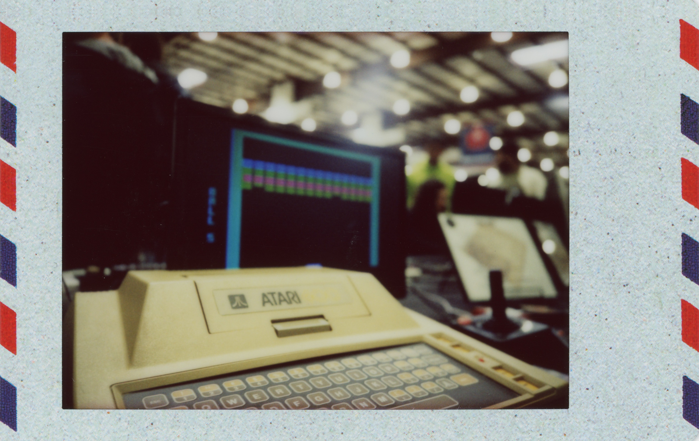
||
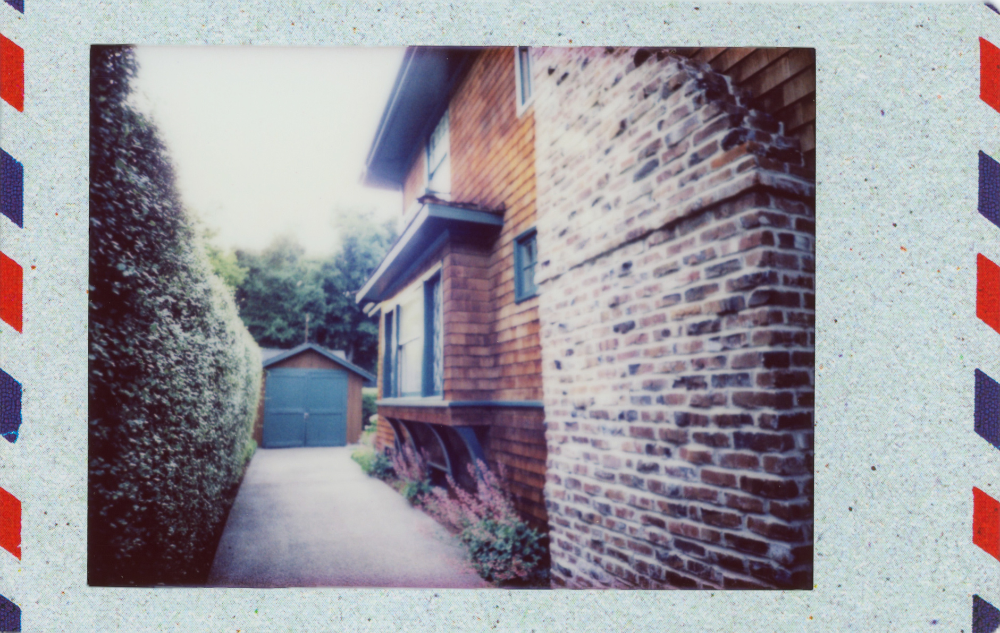
||
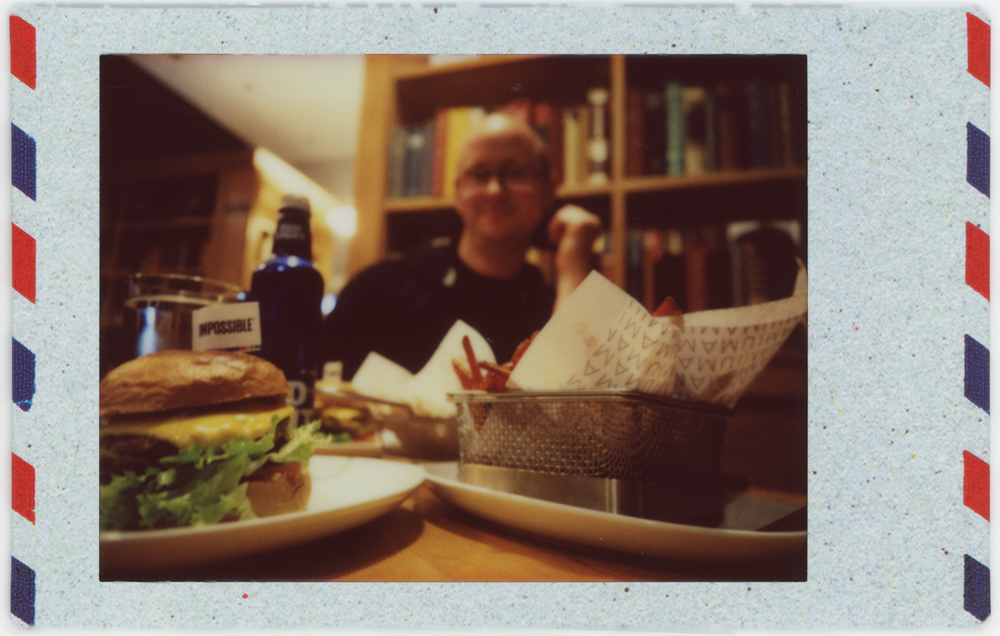
||


---
På **måndagen** var det dags att besöka Google och Facebook. Det fina mottagandet av vår svenska representant från Google fick oss snabbt att känna oss välkomna. Fokus låg mycket på hur företaget hanterar data och hur dess tjänster kan användas för att öka tillgängligheten i skolan. I Sverige är Googles Chromebook-laptops och Drive-tjänster väldigt vanlig ute bland skolorna, och lösningar kring att hantera lärande genom Drive visades upp. Det sades i stort sett rakt ut att Google ser sig själva som ingenjörer som vill lösa världens problem med data, men det kändes som att det lades kanske lite för lite vikt vid  mjukvare världen och andra perspektiv på mänsklig natur. Vi dök sedan snabbt in bland (de något förfallna) Android-statyerna för ett gruppfoto innan bussen rullade vidare mot Facebook.

Facebook kändes inte lika klockrent. Det var ju kul att se deras interna campus med glassbarer, cykelkök och kreativa små krypin men efter ett tag började det kännas som att den långa turen i detta Disneyland mest var för att fylla ut ett annars magert program. När vi väl fick sitta ner i en föreläsningssal var det ändå intressant att höra om facebooks rankningssystem för newsfeeden och samarbetet med fact checkers. Någon vidare tid för frågor blev det dock inte.

Med besök på Nordic Innovation House i downtown Palo Alto och en vandring på Stanford var första dagen i en väldigt händelserik vecka slut.


||
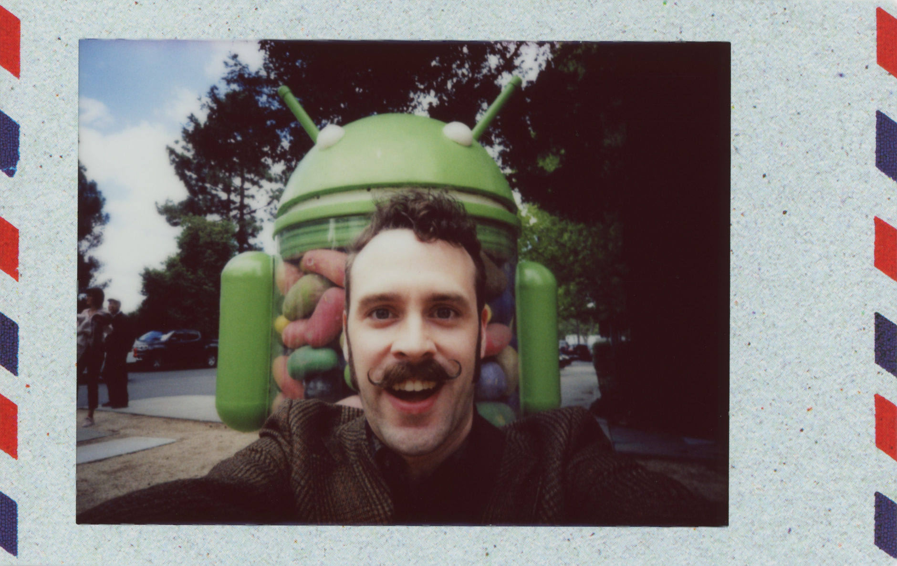
||
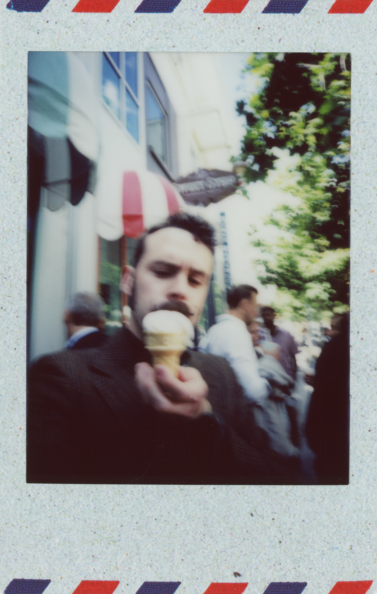
||


---

**Tisdagen** var helt vigd åt Apple, och tillbringades i deras moderskepp, ett alldeles nybyggdt glas-UFO. Dagen var fylld av föreläsningar från folk relativt högt upp i organisationen och med väldigt bra dialog och massor av tillfällen att ställa frågor.
Dagens höjdpunkt var helt klart professor Kim Silverman, som varit hos Apple i nästan 30 år och fokuserar på talsynthes och taligenkänning. Han är dessutom [magiker](http://www.oaklandmagiccircle.com/wordpress/oakland-magic-circle-may-meeting/) och ser ut som en tvättäkta trollkarl, och höll hela delegationen trollbunden med en privat trollerishow.

Vi fick en lång genomgång av huvudarkitekten bakom nya högkvarteret och känslan för detaljer var verkligen sinnessjukt hög. Bara den möteslokalen vi satt i visade prov på exempel på sinnrikt infällda högtalare, akustisk rumgeometri och specialtillverkat mikroperforerat, ljuddämpande trä. Däremot hade de fått sätta in en hel extra bänkrad bara för oss, för så här stor delegation hade de aldrig haft tidigare! ... och ett av väggmaterialen hade nyligen fått bytas ut, för akustiken i rummet hade trots allt förarbete inte riktigt blivit som de hade tänkt.

Vi fick höra om hur Apple ser på hur ny teknik och pedagogiska metoder ska introduceras i skolan ("investera inte i detta om inte lärarna är med på tåget!"). Vi fick även delta i workshops kring hur AR kan användas för att lära ut kodande. Jag gillar AR men tycker ibland det känns lite väl påtvingat, och med rykten om att Apples AR-headset går en osäker framtid till mötes känns det ännu mindre relevant.

Om Google var ingenjörerna kändes Apple mer som arkitekter och (väldigt preskriptiva) designers, med mer uppskattning för design och mjukare världen. Det känns dock rätt tydligt att de anser sig veta bäst själva, vilket kan bli problematiskt när nästan hela utvecklingsteamet är samlokaliserat och stöpt i en viss regions- och företagskultur. Jag uppskattade dock verkligen hur de lade fokus på hur de gör sina system tillgängliga för folk med funktionsvariationer. För övrigt var screen-reader-teknologin som Kim Silverman pratat om en viktig punkt under utvecklarkonferensen WWDC som gick av stapeln några veckor senare, där stort fokus lade på möjligheten att använda [iPhones och Macar med enbart rösten](https://youtu.be/aqoXFCCTfm4).

På kvällen åkte vi till San Francisco, där jag och Martin efter ett snabbt besök vid Golden Gate (där vi fick hälsa på tvättbjörnar!) passade på att titta förbi de historiska gaykvarteren i Castro. I brist på bättre lokaltrafik var det som vanligt Lyft som gällde, ett alternativ till Uber.


||
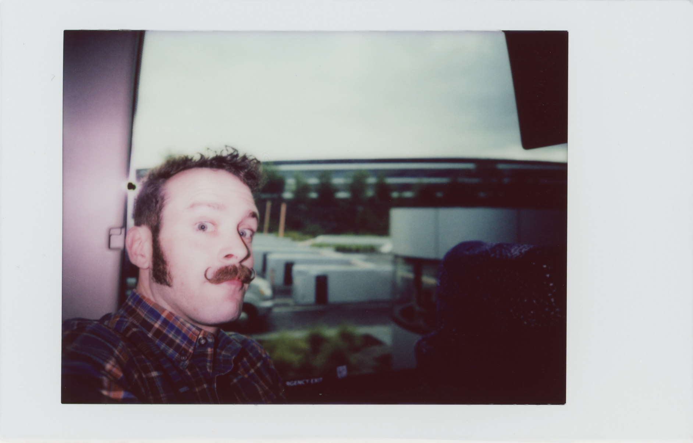
||
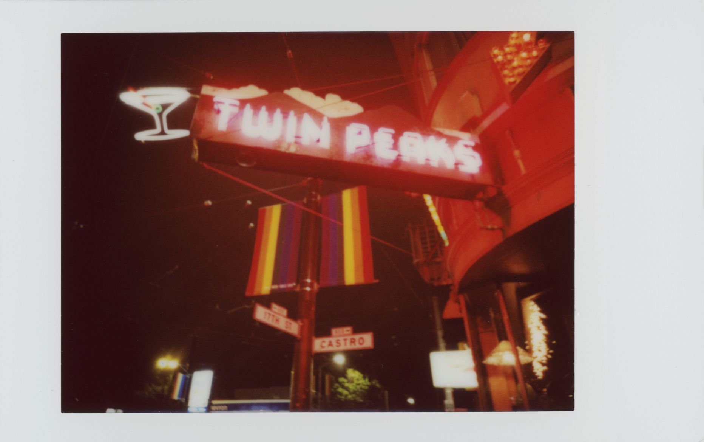
||


---

På **onsdagen** körde vi workshop för hela delegationen i San Francisco, där jag och Martin dokumenterade för fullt och spelade in en intverju med den alltid lika skarpe [Andreas Ekström](https://www.andreasekstrom.se/en-anteckning-fran-vastkusten/). Sedan flög vi till Seattle.

San Francisco var något av en besvikelse, med häftigt landskap men rätt så slitet i övrigt. Staden har verkligen problem med att vara ett ställe folk faktiskt kan bo i, med skenande bostadspriset och stor hemlöshet som följd. Att teknikjättar som Twitter och Uber bara ligger ett stenkast från de hårdast drabbade områdena gör en bitter. 

Seattle däremot satte sig rätt i hjärtat med sin fantastiska natur och ett fint och alldeles lagom stort vattennära downtown. Hipsterfaktorn var skyhög. Det sena barhänget med en lokal tekniknörd och tillika Pokémonfantast med skvaller om både Amazon och Microsoft var en av höjdpunkterna.


||
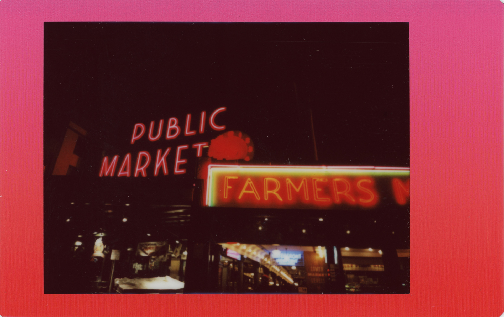
||
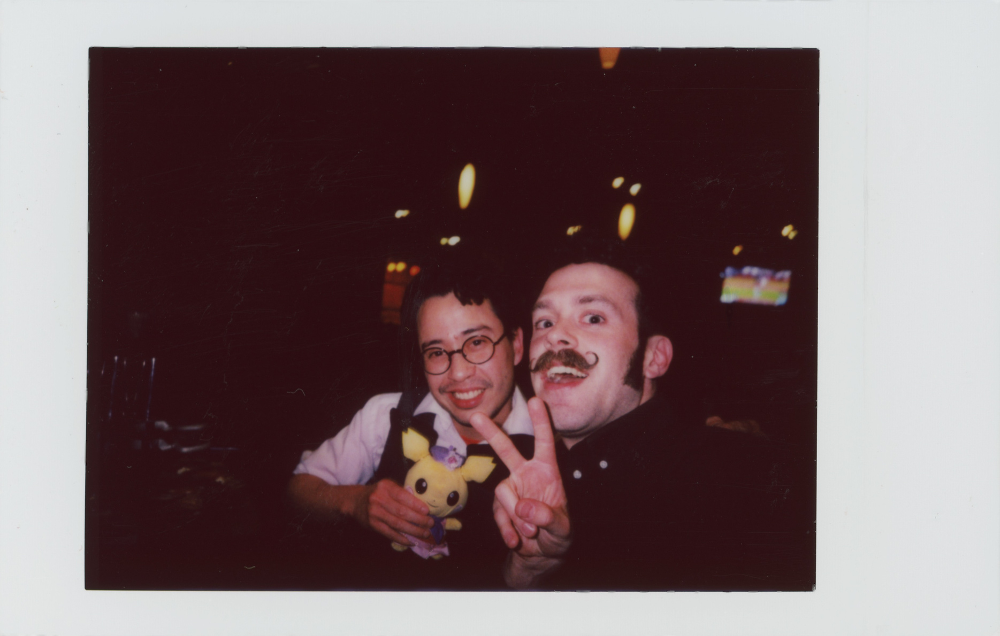
||


---

**Torsdagen** var vår första heldag i Seattle och ägnades åt Amazon. De liknande i mångt och mycket Google, med ett starkt ingejörsfokus och väldigt många olika sorters produkter. De är mest kända för sin onlinehandel, som utgör över 50% av totala e-handeln i USA, men deras molntjänster driver även mycket stor del av internet och är grunden för väldigt många andra teknikföretag. Att äntligen få testa Amazon Go var mest spännande: En liten dagligvarubutik som trackar din fysiska kundkorg helt automatiskt och drar totalen från ditt Amazon-konto när du går ur spärrarna, utan nån som helst kassa. Jag och många andra i sällskapet lade största delen av besöket på att spana efter sensorer och försöka lura systemet (vi lyckades inte)! 

Butiken låg mitt i deras stora campus i downtown Seattle, med fantastiska sfäriska växthus i centrum där de anställda kan hänga. Hundpolicyn var nog det bästa, med en massa hundar på kontoren och med fina parker och andra faciliter åt de fyrfota anställda. Jag har nog aldrig sett så många vovvar ute på promenad som i downtown Seattle. Det känns dock problematiskt att ett företag kan köpa upp flera stora kvarter mitt i stan och där helt dominera området. 

En av anledningarna till att dessa företag satsar så mycket på utbildning är att de vill säkra upp sin egna framtida kompetensförsörjning. Hos Amazon var detta extra tydligt, där de konstant har brist på 20 000-30 000 tjänster bara i Seattleområdet. Förutom material för grundskolan har de även massvis med diplomerande eftergymnasiala kurser tillgängliga online, med intressant teknik för att dynamiskt generera och anpassa kursplaner. Som jag nämnde i den andra bloggposten har [Jonas Ivarsson](https://medium.com/@jonas.ivarsson/big-five-och-högre-utbildning-eced1581c06d) på Göteborgs Universitet skrivit mycket om detta.


||
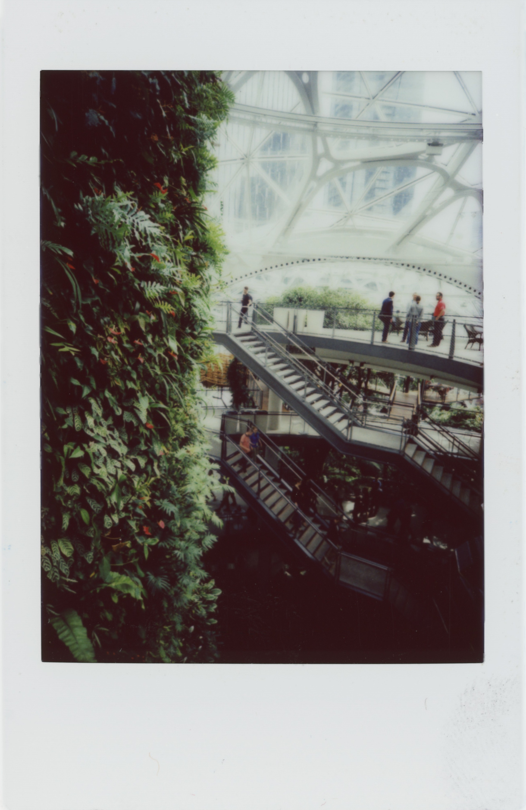
||
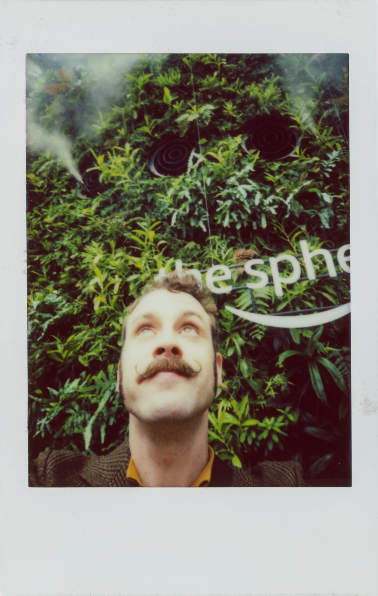
||


---

På **fredagen** avslutade vi veckan med ett besök hos Microsoft, dock hos utbildningsavdelning i Bellevue snarare än hos huvudkontoret i närliggande Redmond. Jag och Martin hade fullt upp med att spela in intervjuer med delegationsmedlemmarna och hann inte uppleva så mycket av dagens program, men det handlade mycket om de läs- och skrivhjälpmedel som finns inbyggda (men är karaktäristiskt nog något dolda) i de vanliga officeprogrammen.

På lördagenen var det dags att resa hem, men innan dess hann flera av oss med ett besök till det riktiga Twin Peaks. Många av utomhusscenerna spelades in i det lilla samhället Snoqualmie, bara en halvtimme från Seattle. Vi blev helt begaistrade av den vackra naturen och dramatiska bergen, och testade förstås cherry pie och kaffe på verklighetens Double R Diner.


||
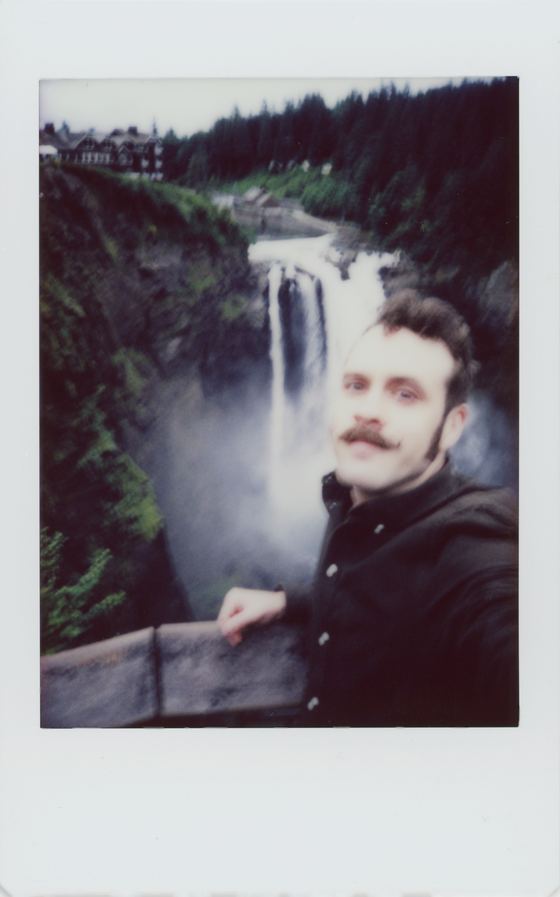
||
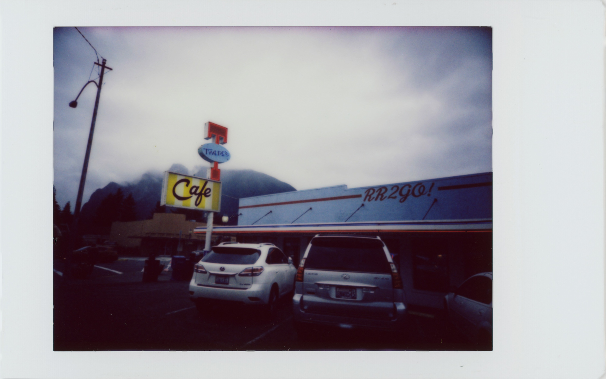
||
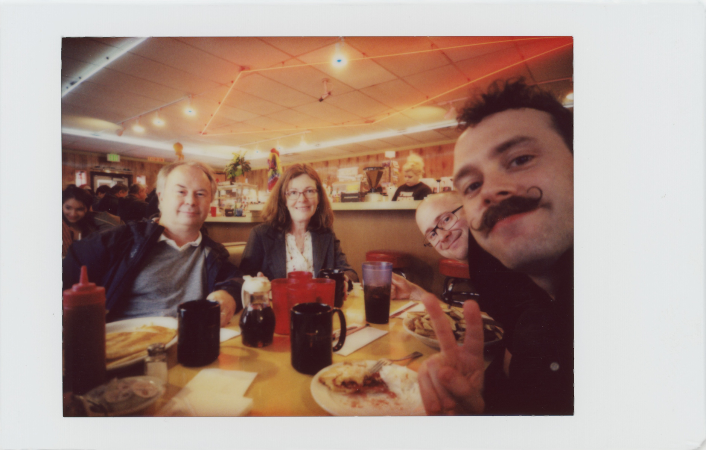
||


Jag är otroligt imponerad över mina kollegor som lyckades styra upp en sån här fullmatad vecka med en så stor delegation. Fem storföretagsbesök på lika många dagar måste vara nästan unikt. Jag hoppas och tror verkligen att denna resa har bidragit med värdefull inblick som hjälper till att vägleda svenskt skolväsende rätt i den digitala framtid vi har framför oss.

På ett personligt plan är jag väldigt glad över att ha fått chansen att uppleva Silicon Valley och Pacific Northwest. Förvisso blev jag något besviken av den förra, men det vägdes upp av den senare. Jag hoppas jag kan återvända till Seattle med omnejd snart igen! 

---
---

I recently posted a [compilation] (https://michelsen.se/post/big-five-articles/) of blog posts about this slightly crazy but absolutely packed journey. All credit for the planning and organization of the trip goes to my colleagues; my main responsibility was to document the trip with photos, video and interviews together with my colleague Martin. Still though, visiting these places and companies has been a long-standing dream for me and I want to put some thoughts into writing. The following are my own reflections and are not to be seen as representative of my employer RISE. There will also be a whole bunch of Instax selfies! (of course we had a lot of expensive cameras to document the trip professionally with, but sometimes you just gotta separate professional footage and snapping shots just for fun!)

---

Before the program really started, we at RISE and others who arrived early spent the weekend at the Bay Area Maker Faire. Among thousands of creators we found everything from [huge elephant-like mechs] (https://youtu.be/ectVSC6f02Q) to cosplayers and steam engines. We interviewed Mozilla, Strawbees and companies that supply medicines with drones. We listened to Adam Savage from Mythbusters in the rain. Fortunately, the fair was not as commercial as I had imagined, but was really a festival that celebrated human creativity. Awesome!
Got a chance to photograph a little with a nice portrait lens during the event, [here's a gallery](https://www.andreasekstrom.se/en-anteckning-fran-vastkusten/) with some of my favorite pictures.

The same weekend we also took the opportunity to tour around Palo Alto where Steve Jobs, Sergei Brin, Mark Zuckerburg and many more have lived. It is also the seat of the private university of Stanford, and has a long history of tech startups. Here and there were signs pointing out historical sites, such as the lab where the integrated circuit was invented or the garage where Hewlett Packard was founded in 1938 (which is considered the start of Silicon Valley's corporate culture). Some of us from RISE also got to pay San Francisco a quick visit for some clam chowder and a visit to the waterfront [Musée Mécanique] (https://en.wikipedia.org/wiki/Musée_Mécanique), an arcade museum focusing on old mechanical gaming machines.


||

||

||

||


---
On **Monday**, it was time to visit Google and Facebook. The nice reception of our Swedish representative from Google quickly made us feel welcome. The focus was very much on how the company handles data and how its services can be used to increase school accessibility. In Sweden, Google's Chromebook laptops and Drive services are very common among schools, and solutions for managing learning through Drive were presented during the visit. It was pretty much stated that Google sees itself as engineers who want to solve the world's problems with data, but it felt like maybe it was putting a little too little weight on the softer world and other perspectives on human nature. We then quickly dived into the (slightly overdue) Android statues for a group photo before the bus rolled on towards Facebook.

The visit to Facebook left a bit more to be desired. It was fun to see their internal campus with ice cream parlors, bike workshops and creative little critters but after a while it started to feel like the long trip in this Disneyland was mostly to fill out a rather lean program. Once we got to sit down in a lecture hall, it was nevertheless interesting to hear about Facebook's ranking system for the newsfeed and the collaboration with fact checkers. However, there was little further time for questions.

With a visit to Nordic Innovation House in downtown Palo Alto and a guided tour of the Stanford campus, the first day of a very eventful week ended.


||

||

||


---

**Tuesday** was completely dedicated to Apple, and was spent in their mothership, a brand new glass UFO. The day was filled with lectures from people relatively high up in the organization with lots of opportunities to ask questions.
The highlight of the day was clearly Professor Kim Silverman, who has been with Apple for nearly 30 years and focuses on speech synthesis and speech recognition. He is also a [magician] (http://www.oaklandmagiccircle.com/wordpress/oakland-magic-circle-may-meeting/) and looks like a real wizard, and kept the entire delegation enthralled with a private magic show.

We got a long presentation from the main architect behind the new headquarters and the sense of detail was really staggering. The meeting room we sat in showed samples of impressively recessed speakers, acoustic room geometry and specially manufactured microperforated, sound-damping wood. However, they had to put in a whole extra bench seat just for us, because they had never had such a large delegation before! ...and one of the wall materials had recently been replaced, because after all the acoustics in the room had not really turned out as they had intended.

We were told how Apple is looking at how new technology and educational methods should be introduced to schools ("Don't invest in this unless the teachers are on board!"). We also got to participate in workshops on how AR can be used to teach coding. I like AR but sometimes it feels a bit shoehorned in, and with the rumors that Apple's AR headsets are meeting an uncertain future, it feels even less relevant.

If Google were the engineers, Apple felt more like architects and (very prescriptive) designers, with more appreciation for design and humanities. However, it feels pretty clear that they themselves think they know what's best for their users, which can be problematic when almost the entire development team is co-located and cast in a certain regional and corporate culture. However, I really appreciated how they focused on how to make their systems accessible to people with functional variations. Incidentally, the screen-reader technology that Kim Silverman talked about was an important point during the WWDC developer conference which took place a few weeks later, with a strong focus on the ability to use [iPhones and Macs with voice alone](https://youtu.be/aqoXFCCTfm4).

In the evening we went to San Francisco, where Martin and I, after a quick visit to the Golden Gate bridge (where we were greeted by raccoons!) took the opportunity to look past the historic gay quarter in Castro. In the absence of better public transport we used Lyft, an alternative to Uber.


||

||

||


---

On **Wednesday** we ran a workshop for the entire delegation in San Francisco, where me and Martin documented in full and recorded an interview with the always-as-sharp [Andreas Ekström] (https://www.andreasekstrom.se/en-anteckning-fran-vastkusten/). Then we flew to Seattle.

San Francisco was something of a disappointment, with breathtaking scenery but quite worn and somewhat dysfunctional otherwise. The city really has a problem with being a place people can actually live in, with rising housing prices and high homelessness as a result. The fact that tech giants like Twitter and Uber are just a stone's throw away from the hardest hit areas just isn't right.

Seattle, on the other hand, sat right in the heart with its amazing scenery and a nice and just right big watery downtown. The hipster factor sky high. The late bar hangout with a local tech geek and Pokémon fanatic with gossip about both Amazon and Microsoft was one of the highlights.


||

||

||


---

**Thursday** was our first full day in Seattle and was dedicated to Amazon. They are similar in many ways to Google, with a strong focus on engineering and a wide product portfolio. They are best known for their online commerce, which accounts for over 50% of total e-commerce in the United States, but their cloud services also run a very large part of the Internet and are the basis for many other technology companies. To finally get to test Amazon Go was the most exciting thing: A small grocery store that tracks your physical shopping basket completely automatically and deducts the total from your Amazon account when you leave the barriers, without any cash. Me and many others in the company spent most of the visit looking for sensors and trying to deceive the system (we had no chance)!

The store was located in the middle of their large campus in downtown Seattle, with fantastic spherical greenhouses where employees can hang out. The dog policy was probably the best, with a lot of dogs in the offices and with nice parks and other facilities for the four-legged employees. I've probably never seen so many hot dogs out on a walk as in downtown Seattle. However, it feels problematic that a company can buy up several large blocks in the middle of town and completely dominate the area.

One of the reasons why these companies invest so much in education is that they want to secure their own future skills supply. At Amazon, this was particularly evident, as they constantly lack 20,000-30,000 services in the Seattle area alone. In addition to materials for elementary school, they also have plenty of diploma in post-secondary courses available online, with interesting technology for dynamically generating and adapting syllabuses. As I mentioned in the other blog post, [Jonas Ivarsson] (https://medium.com/@jonas.ivarsson/big-five-and-highre-education-eced1581c06d) at the University of Gothenburg has written a lot about this.


||

||

||


---

On **Friday** we ended the week with a visit to Microsoft, though at the education department in Bellevue rather than at the headquarters in nearby Redmond. Martin and I were busy recording interviews with delegation members and didn't get to experience so much of the day's program, but what we saw was focused on reading and writing tools that are built-in (but are in typical fashion rather hidden) in the regular office programs.

On Saturday it was time to fly home, but before that several of us paid a visit to the real Twin Peaks. Many of the outdoor scenes were recorded in the small community of Snoqualmie, just half an hour from Seattle. We were absolutely enthrilled by the beautiful scenery and dramatic mountains, and of course tested the cherry pie and coffee at the real life Double R Diner.


||

||

||

||


I am incredibly impressed with my colleagues who managed to put together such a well-planned week with such a large delegation. Five large company visits on equal days must be almost unique. I hope and believe this trip has provided valuable insight that can help in guiding the Swedish education system in the right direction in the digital future that lies before us. 

To end on a personal note I am incredibly happy to have gotten to experience Silicon Valley and the Pacific Northwest in person. Though the former left me somewhat disillusioned, the latter was breathtaking and I hope to return to it soon. 