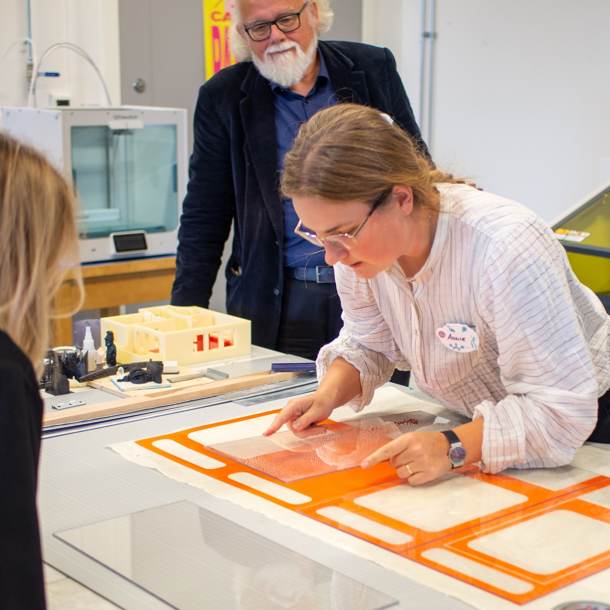

*English version below*

De senaste åren har Riksantikvarieämbetet arrangerat ett hackathon i Visby. Nu var det dags igen och jag och några kollegor åkte dit och hackade loss. Jag hade turen att hamna med ett härligt gäng och tillsammans tog vi fram konceptet TELEPOP.

> En interaktiv pop-up-utställning som tar ut museets kunskap och samlingar till det offentliga, och engagerar allmänhet och skolbarn genom telefonsamtal och möten med karaktärer från historien. 
 
> En telefonlinje tillbaka till muséet med berättelser från vår egna nutid.
Rutorna går att dimma så de funkar som projektionsskärmar (något vi faktiskt lyckades bygga in i prototypen!) och den kan vikas ut och användas i undervisningen för skolklasser.

Med mig var Annie Rosén och Josefine Ottosson från Jönköpings läns museum, Alexandra Kronqvist från Uppsala universitet och Jan-Ivar Johansson som leder ett gäng föreningar runt Sunderbyn. Vi hade turen att sitta i anslutning till RAÄs stora fina verkstad där vi fick hjälp av hanterverkarna att realisera vår prototyp.

Tillsammans med teamet som tog fram ett helt lysande koncept för arkeologispel vann vi omröstningen bland projektdeltagarna!

Det här var mitt första besök till Gotland. Det jag såg av ön och Visby var helt fantastiskt och det vackra höstvädret gjorde det ännu bättre. Jag vill åka tillbaka så snart som bara möjligt!

---

In recent years, the Swedish National Heritage Board has organized a hackathon in Visby. Now it was time again and me and some colleagues went there and hacked away. I was lucky enough to end up with a lovely bunch and together we developed the concept TELEPOP.

> An interactive pop-up exhibition that takes the museum's knowledge and collections to the public, and engages the public and school children through phone calls and meetings with characters from history.
 
> A telephone line back to the museum with stories from our own present day.
The window panes can be tinted so they function as projection screens (something we actually managed to build into the prototype!) and it can be folded out and used in teaching for school classes.

With me were Annie Rosén and Josefine Ottosson from Jönköping County Museum, Alexandra Kronqvist from Uppsala University and Jan-Ivar Johansson who lead a bunch of associations around Sunderbyn. We were fortunate to be right next to RAÄ's large workshop where there was lots of tools and experienced builders to help us create our prototype.

Together with the team behind an absolutely brilliant concept for an archeology game we won the vote among the project participants!

This was my first visit to Gotland. What I saw of it and Visby was absolutely fantastic and the beautiful autumn weather made it even better. I want to go back as soon as possible!