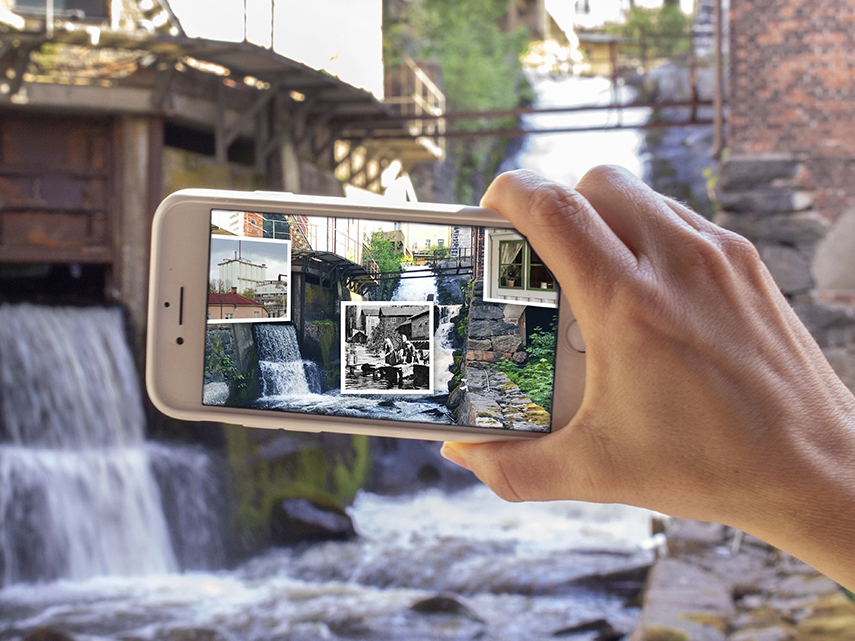

**Through your mobile phone you get access to a new layer of storytelling on your walk around a industrial heritage site and a bronze age place of worship.**

ENTER Mölndal was a collaborative project between [RISE](https://www.ri.se/), [Mölndals stadsmuseum (Mölndal city museum)](https://www.molndal.se/molndals-stadsmuseum.html) and the artist [Marika Hedemyr](https://www.marikahedemyr.com/). The project was realized with support of The Torsten Söderberg Foundation. It Consists of two mixed reality walks - a web-based story in the old industrial society Mölndals Kvarnby and an app for Tulebosjön’s (Lake Tulebo’s) Bronze Age site.

The aim of the project has been to bring cultural environments and places to life in Mölndal through new technology and innovative narrative methods, with the goal being to increase involvement in the urban landscape by creating interest, curiosity and participation in cultural environments in Mölndal.

In the project I led the development of a web-based storytelling platform, as well as the development of an AR-driven app based on Unity as well as ARKit and ARCore. The development was done in an iterative and user-centered method, with a multitude of prototypes and test runs along the way. The soundtrack for Tulebosjön was created by [Fredrik Jonasson](http://fredrikjonasson.net) and the art assets were created by [Andrea Jörgensen](https://andreajorgensen.se/).

*By working site-specific with new mobile technology, the diversity of stories that a place carries is opened and gives the opportunity to show on site what you no longer see. With Augmented Reality technology and a script combining facts with poetic and performative narrative techniques, ENTER Mölndal creates a consciousness of history that is based on inclusion and many voices and which engages multiple senses of the visitor.*

**Source Code**
The source, including art assets, is released under a CC BY-NC-SA 4.0 license.

[ENTER Mölndal - Kvarnbyn](https://git.ri.se/jacob.michelsen/enter-kvarnbyn)

[ENTER Mölndal - Tulebosjön](https://git.ri.se/jacob.michelsen/enter-tulebosjon)

<!-- Cultural environments are a common source of knowledge and experiences, but only when a support is given to "read" this knowledge and thereby see oneself in relation to the place and the story is inclusive in its depiction of cultural history. In 2018, Mölndal's City Museum launched ENTER Mölndal, in collaboration with RISE Interactive and Marika Hedemyr Projects. -->

