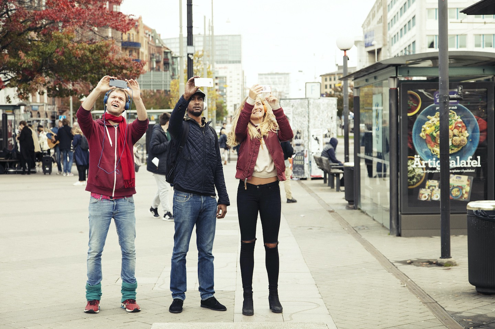

**Where are you going? How do you relate to the person next to you?**

In the project I collaborated with Marika in creating an AR-driven app based on Unity and ARToolkit. The work was premiered as part of the Extended Program of the GIBCA art festival in 2017.

*A smartphone in your hand can open up new worlds and connections, and also create isolated bubbles and segmented societies. In Next to You at Korsvägen, Marika Hedemyr explores this paradox through an interactive walk where your choice of direction is crucial for the course of events. The work remixes the city's visions of Göteborg as a destination with quotes from Vilhelm Moberg's novel series The Emigrants, and facts about Korsvägen. A private mixed-reality situation where the experience of the place and the passers-by is intensified.*

**Source Code**
The source, including art assets, is released under a CC BY-NC-SA 4.0 license.

[Next to You at Korsvägen](https://git.ri.se/jacob.michelsen/next-to-you-korsvagen)